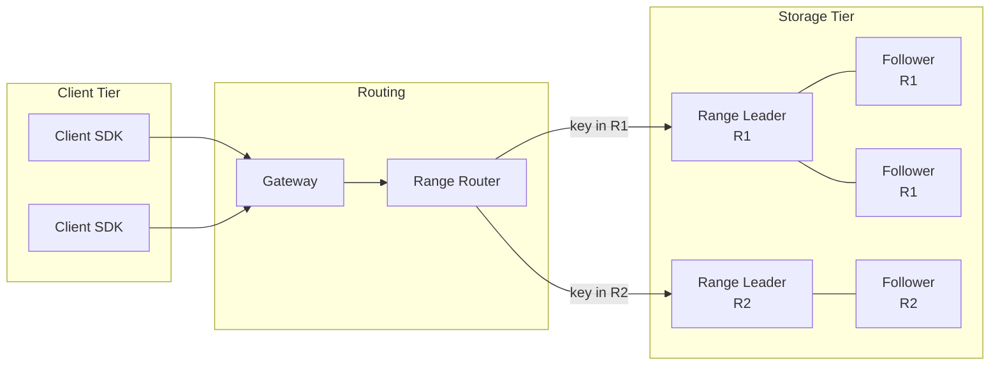
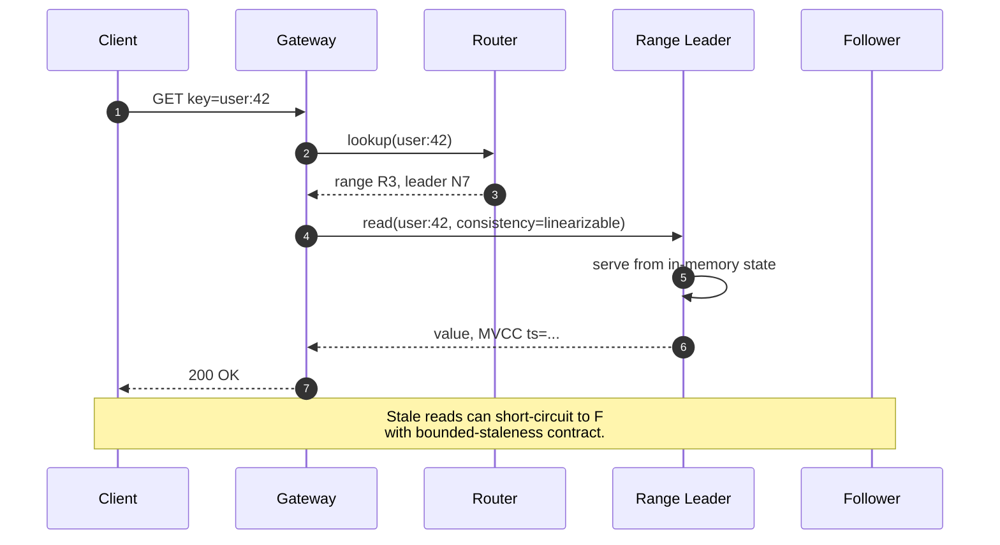
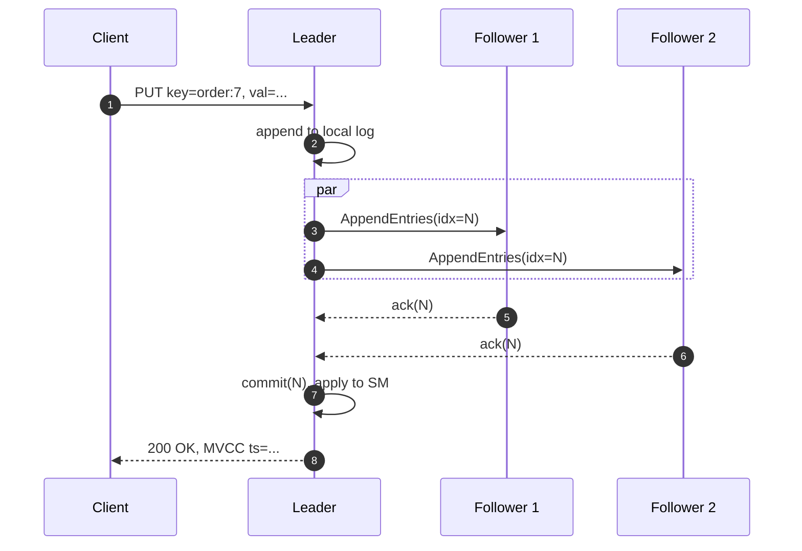
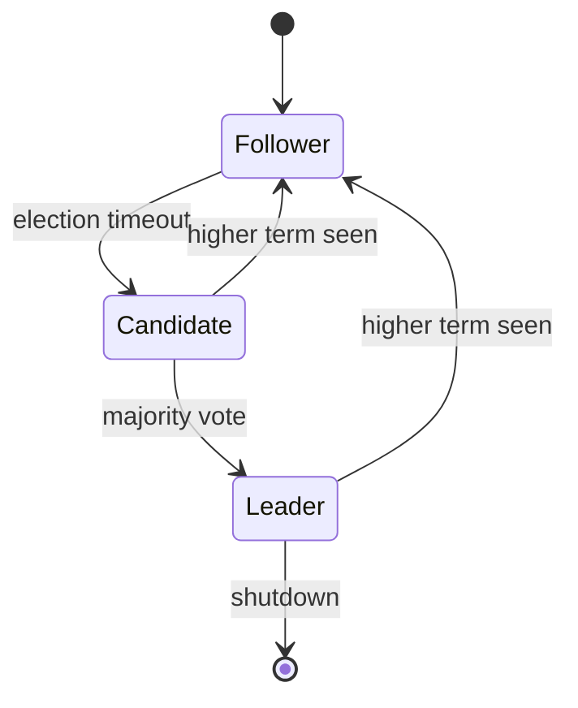
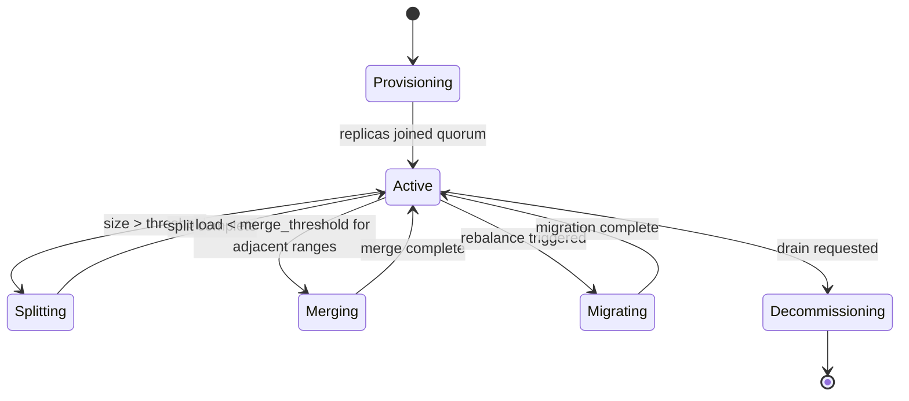
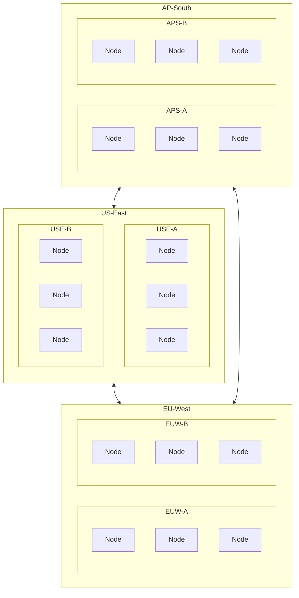
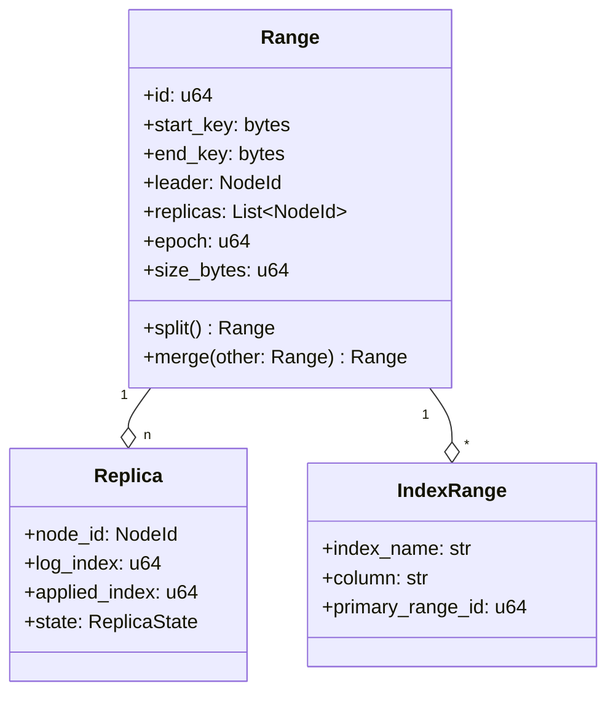
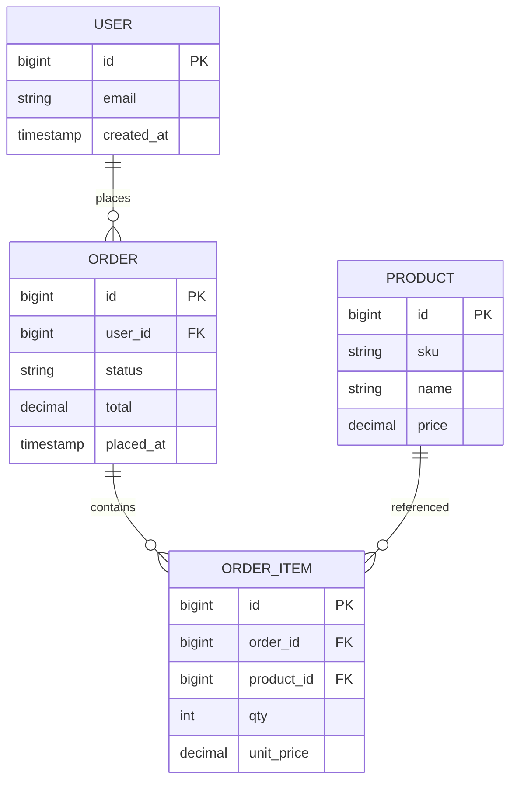
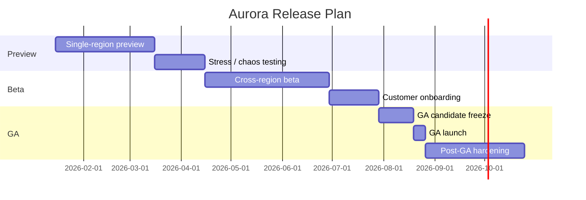
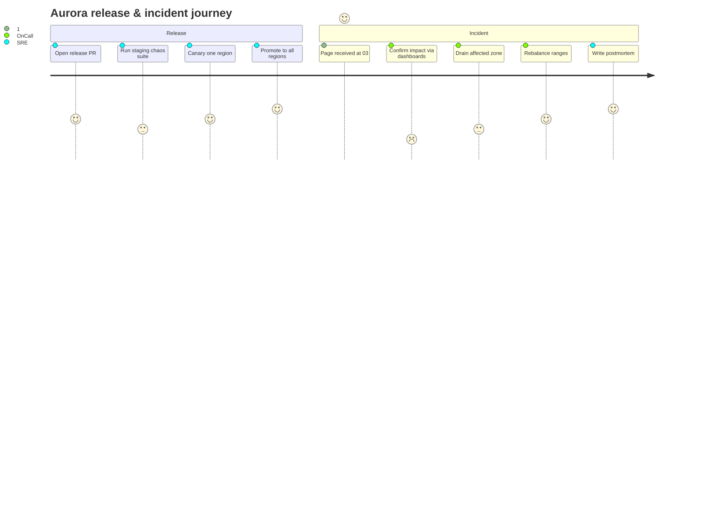

# Aurora: A Distributed Key-Value Store

A reference architecture for a multi-region, strongly consistent key-value store with tunable replication. Aurora is designed for workloads that need linearizable reads, replication across geographically distant regions, and predictable tail latency under partial failure.

## System Overview

Aurora partitions the keyspace into ranges. Each range is replicated across a configurable number of replicas using Raft. A coordinator service routes client requests to the appropriate range leader. Storage is pluggable; the reference implementation uses RocksDB.



## Read Path

Reads route to the range leader by default. A staleness-tolerant client may read from a follower with a bounded-staleness contract.



## Write Path

Writes go through Raft. The leader appends to its log, replicates to a quorum of followers, and applies to the state machine on commit.



## Replica State Machine

Each replica is a small state machine driven by Raft.



## Range Lifecycle

A range moves through a small set of states as it grows, splits, merges, or migrates.



## Cluster Topology

Three regions, two zones each, three storage nodes per zone. The routing tier is region-local for predictable client latency.



## Schema and Indexing

User-facing entities are stored as sorted byte ranges. A secondary-index range references the primary by primary key.



## Logical Schema



## Release Plan

We ship Aurora in three phases: a single-region preview, a cross-region beta, and general availability with strict SLAs.



## Ops Journey

A walk-through of how a release lands and how on-call experiences a regional incident.



## Failure Modes

| Failure | Detection | Mitigation | Customer impact |
|---------|-----------|------------|------------------|
| Single replica down | Heartbeat timeout, 5s | Range leader continues with quorum | None |
| Leader down | Election timeout, 1.5s | New leader elected from quorum | ≤ 2s tail latency spike |
| Zone partition | Routing health check, 10s | Drain zone, reroute clients | Brief 5xx burst |
| Region partition | Cross-region probe, 30s | Demote region, serve other regions | Region-local writes blocked |
| Disk full | Storage telemetry, 60s | Move ranges, page on-call | Read-only fallback |
| Corrupted log | Checksum mismatch | Reload from snapshot, re-replicate | None if quorum healthy |

## Configuration Reference

```yaml
cluster:
  name: aurora-prod
  regions:
    - id: us-east
      zones: [a, b]
    - id: eu-west
      zones: [a, b]
    - id: ap-south
      zones: [a, b]

raft:
  election_timeout_ms: 1500
  heartbeat_interval_ms: 250
  max_inflight_msgs: 256
  snapshot_interval: 100000

storage:
  engine: rocksdb
  block_size_kb: 32
  compression: zstd
  bloom_bits_per_key: 12

rebalancer:
  enabled: true
  max_in_flight_moves: 8
  size_balance_pct: 5
  qps_balance_pct: 10
```

## Closing

Aurora's design follows a small set of choices: ranges as the unit of replication, Raft for ordering, range leases for routing, and operator-driven rebalancing. The remainder of this document is a deeper tour of each layer.
