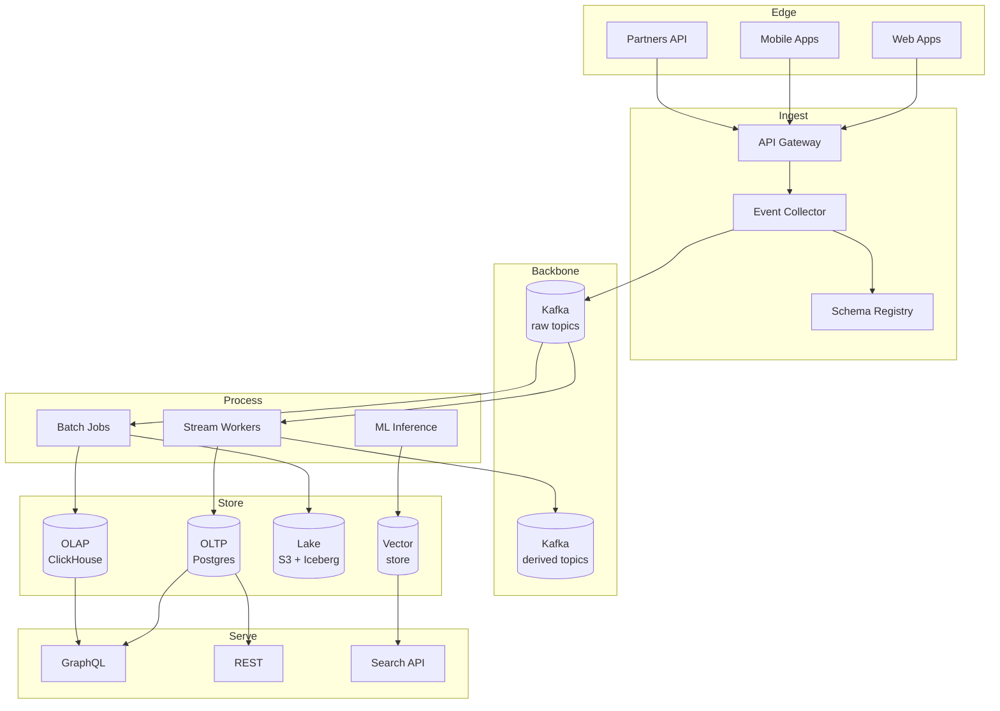
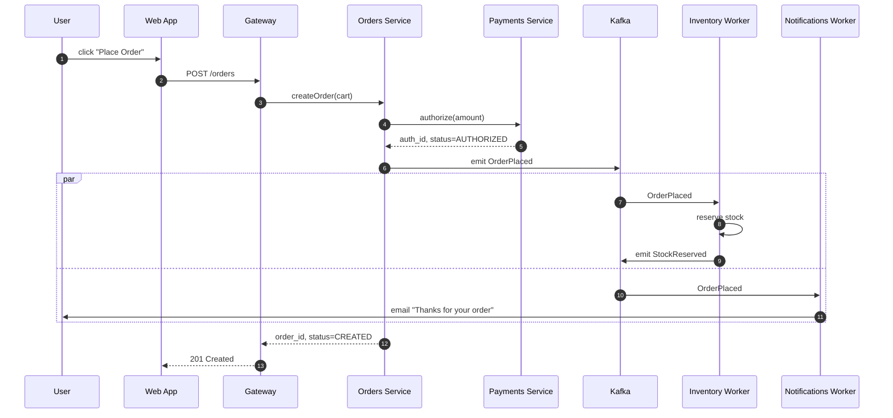
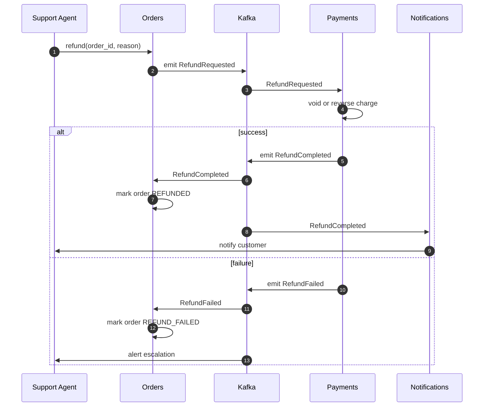
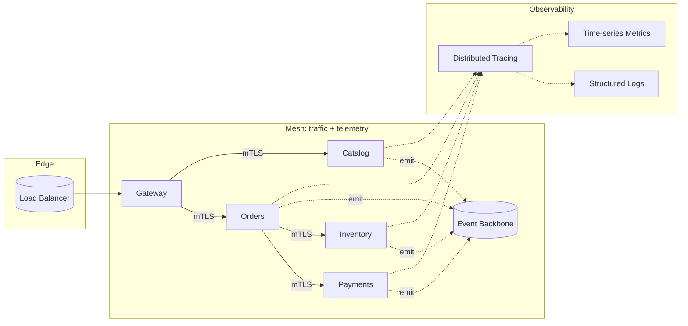
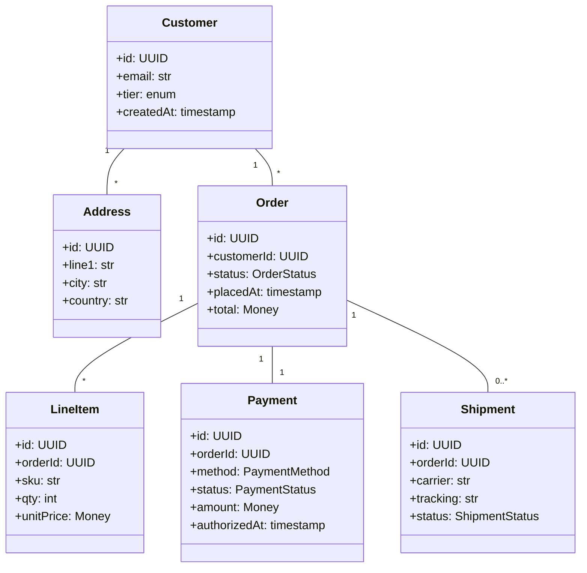
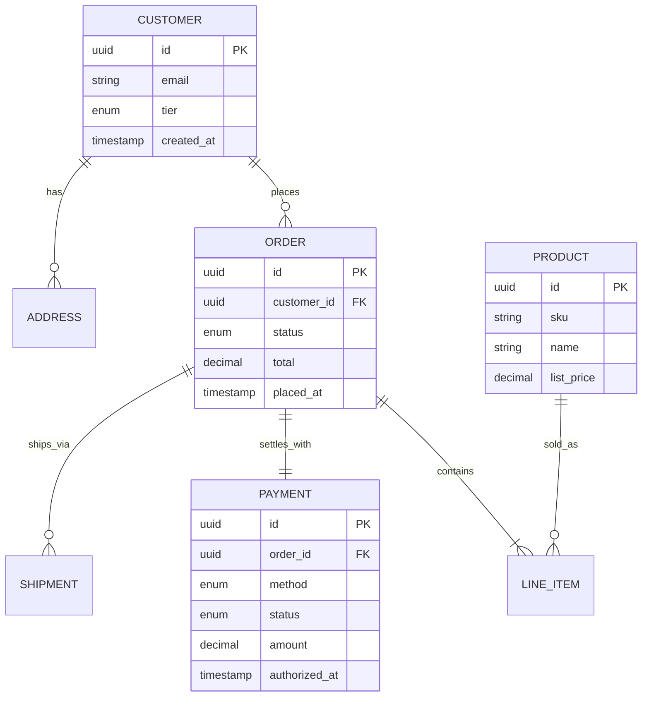
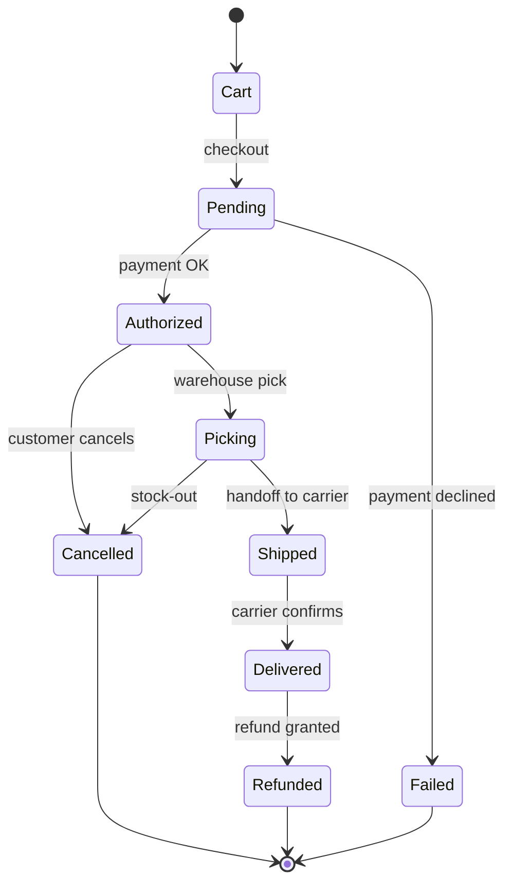
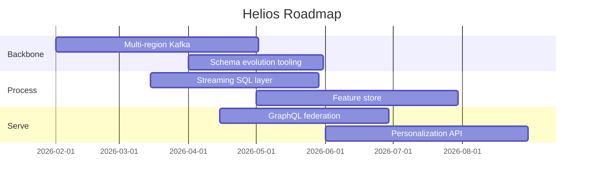

# Helios: Event-Driven Platform Architecture

A reference platform architecture for an event-driven enterprise system spanning ingest, processing, storage, and serving. Helios assumes mixed workloads (transactional, analytical, ML) and a "log as the source of truth" data philosophy.

## Logical Layers

## End-to-End Order Flow

A canonical "place an order" trace across the platform.

## Saga: Refund

A refund spans Payments, Orders, and Notifications, coordinated as a saga via the event log.

## Service Mesh

## Domain Model

## ER View

## Order State Machine

## Deployment Quadrants

| Tier | Stateless | Stateful | Notes |
|------|-----------|----------|-------|
| Edge | CDN, WAF, gateway | — | autoscaled, terraform-managed |
| Compute | Stream workers, REST APIs | — | k8s, HPA on QPS |
| Backbone | — | Kafka, Schema Registry | 3 brokers/zone, mTLS |
| Storage | — | Postgres (primary+replica), ClickHouse, S3 | nightly backups, PITR |
| Search | — | Vector store, OpenSearch | snapshot to S3 daily |

## Service Catalog

| Service | Owner | Tier | RTO | RPO | SLO |
|---------|-------|------|-----|-----|------|
| Gateway | Platform | 0 | 5m | 0 | 99.99% / 100ms p99 |
| Orders | Commerce | 0 | 10m | 0 | 99.95% / 200ms p99 |
| Payments | Commerce | 0 | 10m | 0 | 99.95% / 250ms p99 |
| Inventory | Logistics | 1 | 30m | 1m | 99.9% / 300ms p99 |
| Notifications | Growth | 2 | 60m | 5m | 99.5% / 500ms p99 |
| Catalog | Commerce | 1 | 30m | 1m | 99.9% / 200ms p99 |

## Roadmap

## Closing

Helios is opinionated about a small number of things: events as the spine, schemas as contracts, services as composable units. Everything else is intentionally negotiable.
