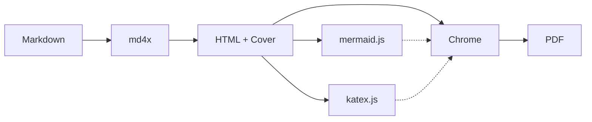
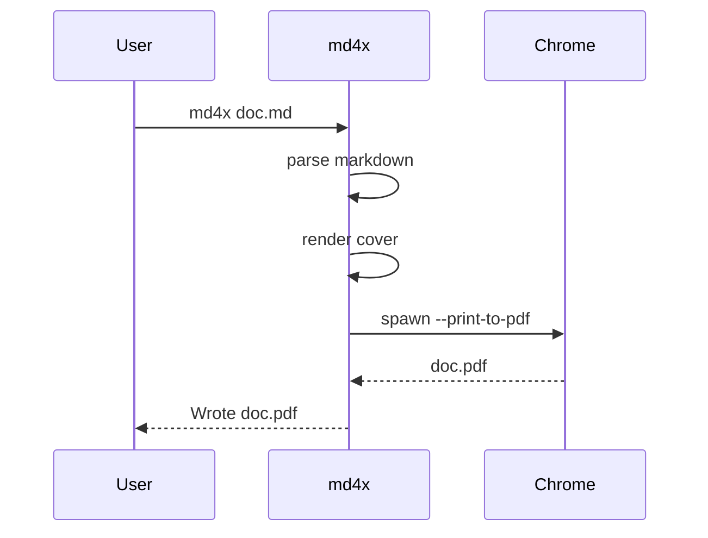
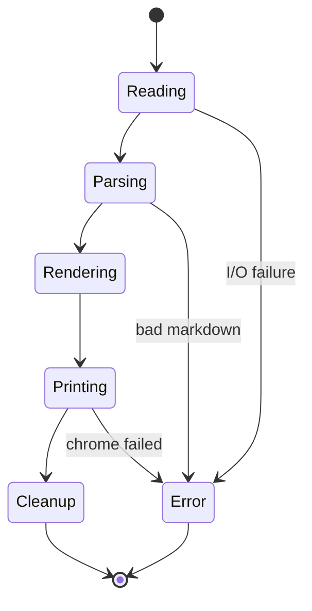
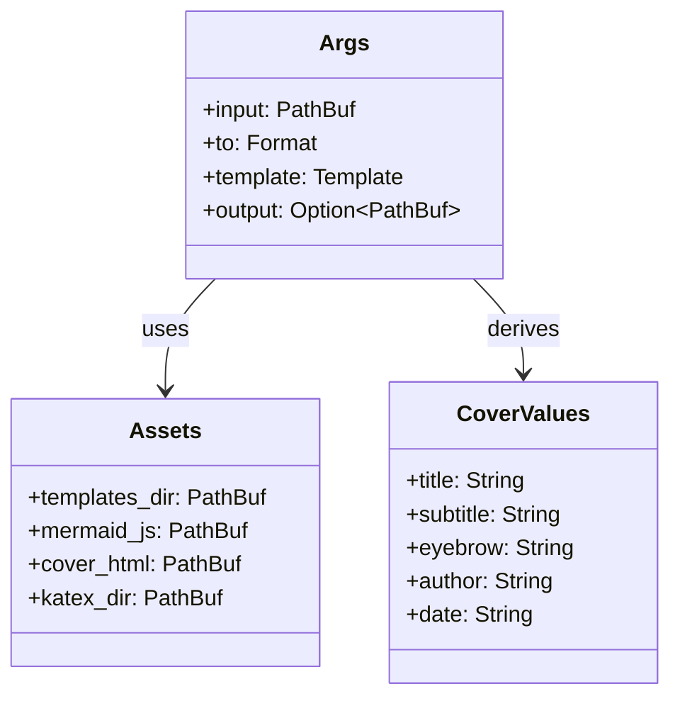
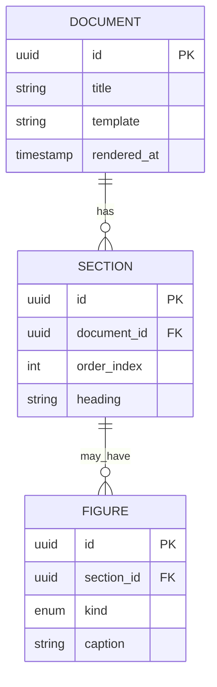
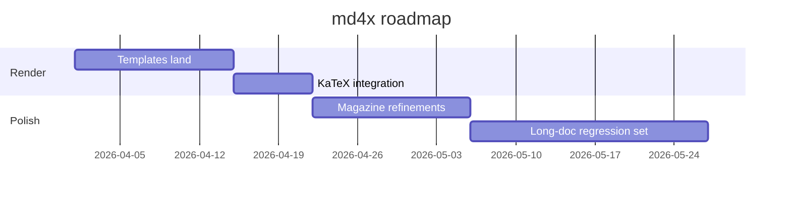
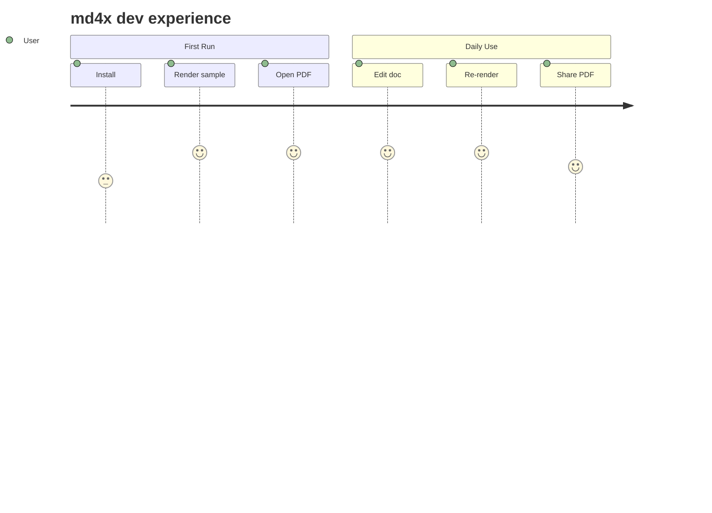

# The md4x Torture Test

A single document that mixes every renderable element md4x supports: long prose, tables, lists, code blocks in multiple languages, mermaid diagrams of every kind, KaTeX inline and display math, inline SVG, data-URI images, footnotes, blockquotes, definition lists, and nested structures. If a regression is going to surface, this is where it surfaces first.

## Prose & Typography

This document begins with a paragraph of unremarkable prose, deliberately a little long, so that the body's line-height, hyphenation, justification, and widow / orphan controls have something to act on. The body should feel comfortable to read across many pages — generous leading, a real serif, and a kerning pass that does not betray its computer origins. The first letter of this paragraph should drop into a cap if the active template asks for one; the closing paragraph of each section should not be split across a page break by more than a single trailing line.

A second paragraph follows immediately. Em-dashes — like this one — should render with proper spacing, and en-dashes (used for ranges, e.g. pages 12–18, or 1995–2026) should remain visually distinct. Smart quotes around 'short phrases' and "longer ones" should travel through unmolested. Numbers should align in tables: 1,234.56 USD, 0.001 grams, 2³² bits.

> A brief blockquote, illustrative rather than profound. The left border, the italic, and the indentation are all part of the test. The text continues for a few lines so the renderer has to decide how to space it relative to the body around it.

## Lists

A short bullet list:

- Mountains
- Rivers
- Coastlines
- Plains

A numbered list with nested children:

1. The first item, with its own sub-bullets:
   - sub-item one
   - sub-item two
2. The second item, with a nested numbered list:
   1. nested numbered one
   2. nested numbered two
3. A third item, plain.

A definition list:

Compiler
: A program that translates source code from one language to another, typically to a lower-level form.

Linker
: A program that combines compiled object files into a single executable, resolving references between them.

Loader
: A program that reads an executable into memory and prepares it for execution.

A task list:

- [x] Spec written
- [x] Tests written
- [x] Implementation lands
- [ ] Visual review
- [ ] Performance pass

## Code

### Rust

```rust
use std::collections::HashMap;

#[derive(Debug, Clone)]
struct Inventory {
    items: HashMap<String, u32>,
}

impl Inventory {
    fn new() -> Self {
        Self { items: HashMap::new() }
    }

    fn add(&mut self, sku: impl Into<String>, qty: u32) -> &mut Self {
        *self.items.entry(sku.into()).or_insert(0) += qty;
        self
    }

    fn count(&self, sku: &str) -> u32 {
        self.items.get(sku).copied().unwrap_or(0)
    }
}

fn main() {
    let mut inv = Inventory::new();
    inv.add("apple", 12).add("orange", 7).add("apple", 3);
    println!("apples: {}", inv.count("apple"));
}
```

### Python

```python
from dataclasses import dataclass, field
from typing import Iterable

@dataclass
class Histogram:
    bins: list[int] = field(default_factory=list)
    counts: list[int] = field(default_factory=list)

    def observe(self, x: float) -> None:
        for i, edge in enumerate(self.bins):
            if x < edge:
                self.counts[i] += 1
                return
        self.counts[-1] += 1

    def percentile(self, p: float) -> float:
        total = sum(self.counts)
        if total == 0: return float("nan")
        target = total * p
        running = 0
        for i, c in enumerate(self.counts):
            running += c
            if running >= target:
                return self.bins[i]
        return self.bins[-1]
```

### TypeScript

```ts
type Result<T, E> = { ok: true; value: T } | { ok: false; error: E };

async function fetchJson<T>(url: string): Promise<Result<T, string>> {
  try {
    const r = await fetch(url);
    if (!r.ok) return { ok: false, error: `HTTP ${r.status}` };
    return { ok: true, value: (await r.json()) as T };
  } catch (e) {
    return { ok: false, error: e instanceof Error ? e.message : String(e) };
  }
}
```

### SQL

```sql
WITH active_users AS (
  SELECT user_id
  FROM events
  WHERE event_at > now() - INTERVAL '30 days'
  GROUP BY user_id
  HAVING COUNT(*) > 5
)
SELECT u.user_id, u.email, COUNT(o.id) AS orders, SUM(o.total) AS revenue
FROM active_users u
LEFT JOIN orders o ON o.user_id = u.user_id AND o.placed_at > now() - INTERVAL '30 days'
GROUP BY u.user_id, u.email
ORDER BY revenue DESC NULLS LAST
LIMIT 50;
```

### Bash

```bash
#!/usr/bin/env bash
set -euo pipefail

usage() { echo "usage: $0 <input.md> [output.pdf]" >&2; exit 1; }

[[ $# -ge 1 ]] || usage
input=$1
output=${2:-${input%.md}.pdf}

if [[ ! -f $input ]]; then
  echo "no such file: $input" >&2
  exit 2
fi

md4x "$input" -o "$output"
```

## Math

Inline: a mixture of $\alpha + \beta = \gamma$, $\sum_{i=1}^n x_i$, $\int_0^\infty e^{-x^2}\,dx = \tfrac{\sqrt{\pi}}{2}$, $f(x) = \mathcal{O}(x \log x)$, and $|\psi\rangle = \alpha |0\rangle + \beta |1\rangle$.

Display math, single line:

$$\hat{\theta} = \arg\min_\theta \frac{1}{n} \sum_{i=1}^n \ell(y_i, f_\theta(x_i)) + \lambda \, \Omega(\theta).$$

A matrix:

$$A = \begin{pmatrix} 1 & 2 & 3 \\ 4 & 5 & 6 \\ 7 & 8 & 9 \end{pmatrix}, \qquad \det A = 0.$$

Aligned equations:

$$\begin{aligned}
y_t &= W h_t + b, \\
h_t &= \tanh(U x_t + V h_{t-1} + c), \\
\mathcal{L} &= -\sum_t \log p(y_t \mid h_t).
\end{aligned}$$

A piecewise function:

$$\mathrm{ReLU}(x) = \begin{cases} x & x \geq 0, \\ 0 & x < 0. \end{cases}$$

A summation with a long upper bound:

$$Z = \sum_{(x, y) \in \mathcal{X} \times \mathcal{Y}} \exp\!\left( -\frac{E(x, y)}{kT} \right).$$

## Mermaid Diagrams

### Flowchart



### Sequence



### State Diagram



### Class Diagram



### ER Diagram



### Gantt



### Journey



## SVG

A small inline schematic.

<p style="text-align:center; margin: 1.4em 0;">
<svg viewBox="0 0 400 180" width="80%" xmlns="http://www.w3.org/2000/svg">
  <defs>
    <linearGradient id="g" x1="0" x2="1">
      <stop offset="0%"  stop-color="#fef3c7"/>
      <stop offset="100%" stop-color="#fbbf24"/>
    </linearGradient>
  </defs>
  <rect x="10" y="40" width="380" height="100" fill="url(#g)" stroke="#b45309" rx="8"/>
  <text x="200" y="98" text-anchor="middle" font-family="Iowan Old Style,Georgia,serif" font-size="22" font-weight="700" fill="#7c2d12">md4x · render anything</text>
</svg>
</p>

A data-URI raster:

<p style="text-align:center; margin: 1.4em 0;">

</p>

## Tables

A wide comparison table:

| Tool | Renders math | Renders mermaid | Vendor deps | Single binary | License |
|------|--------------|-----------------|-------------|----------------|---------|
| md-to-pdf.sh | no | yes (via mmdc) | bun, pandoc, mmdc | no | MIT |
| pandoc | yes (mathjax) | no | LaTeX | yes (~80 MB) | GPL |
| typst | yes (native) | no | none | yes (~30 MB) | Apache-2.0 |
| md4x | yes (KaTeX) | yes (mermaid.js) | Chrome | yes (~500 KB) | MIT |

A narrow numeric table:

| Run | n | mean (ms) | p50 | p99 |
|-----|---|-----------|-----|-----|
| A   | 100 | 14.2 | 13.1 | 41.0 |
| B   | 100 | 12.8 | 12.0 | 36.5 |
| C   | 100 | 13.5 | 12.7 | 39.1 |

## Footnotes

The body of this section references a footnote[^1]. A second footnote follows[^2], and a third on a separate line[^3].

[^1]: First footnote — a short note that should appear at the bottom of the page or at the end of the document, depending on template.
[^2]: Second footnote — slightly longer, with a sentence that wraps. The footnote marker should be a small superscript number that links to the note text.
[^3]: Third footnote — referencing a section above, e.g. the SVG schematic in the previous section.

## Closing

If everything in this document rendered, the templates are in good shape: cover handled, headings hierarchical, body proportional, tables ruled, code blocks contained, math typeset, mermaid drawn, SVG sharp, footnotes linked. If something didn't render, this is where to start the bisect.
