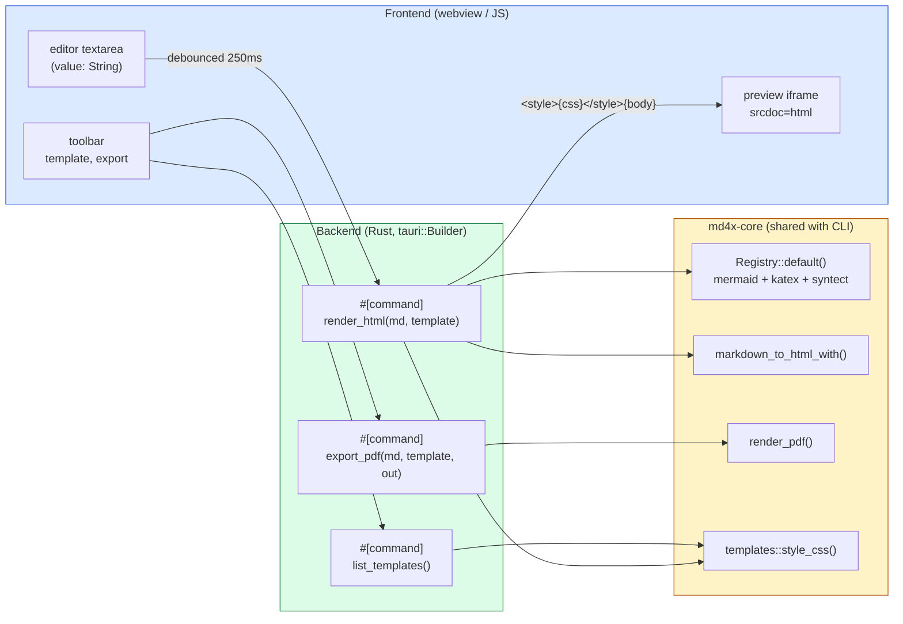
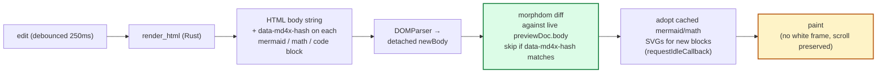
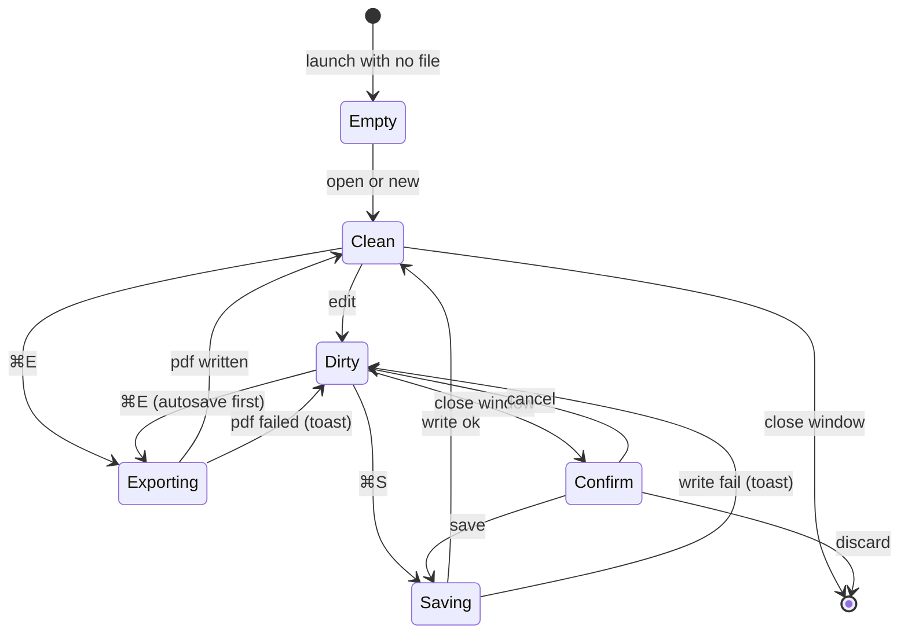

# md4x v0.2.0 GUI — capability map and mockups

*What the Tauri-based, semi-WYSIWYG desktop app does once v0.2.0 ships.
A visual scope statement, not a final pixel spec.*

---

## 1. The pitch

Editor on the left, **live magazine-quality PDF preview on the right**.
Hot-swap among six templates and watch your draft re-typeset in under a
second. Export to PDF when you're done. That's the whole tool.

The constraint: anything you can render with the CLI, you can edit and
preview in the GUI — same kernel, same plugins, same templates. The GUI
is a *shell*, not a fork.

> **Hard UX rule baked into the design.** The preview pane must
> *never* visibly flash, blank, or full-repaint on edit-driven
> re-renders. MacDown's edit-flash-edit-flash behavior is the negative
> reference; it would kill md4x's wedge on contact. Implementation
> path: in-place DOM diff (morphdom) against the existing preview
> document, with mermaid/KaTeX SVGs preserved by source-hash. Full
> reload happens only on template switch, hidden behind a 150 ms
> two-iframe fade-swap. Encoded in design spec §4.2 (no-flash
> invariant) and §6 (template switch).

---

## 2. Capability map

| Capability | What it means in practice |
|---|---|
| **Live preview** | Type → debounced ~250 ms → re-render the right pane. Mermaid + KaTeX caches keyed on block hash, so unchanged blocks skip re-rendering. |
| **Template hot-swap** | One click cycles among `magazine` / `swiss` / `stem` / `tufte` / `newyorker` / `brutalist`. Same source markdown, six different magazines. |
| **Open / Save / Save As** | Standard file ops on `.md`. ⌘O / ⌘S / ⌘⇧S. Window title tracks dirty state with a leading dot. |
| **Export PDF** | ⌘E. Runs the same `md4x` kernel that the CLI uses; identical PDF output. No surprises between editor preview and final export. |
| **Drag-and-drop** | Drop a `.md` file onto the window to open it. Drop onto the empty welcome state to start editing. |
| **Settings** | Default template, debounce delay, preview zoom, theme. Persisted via `tauri-plugin-store`. |
| **Recent files** | Last 10 opens; shown on the welcome state and under File → Recent. |

Things the GUI is **not** doing in v0.2.0: outline pane, find/replace
inside the editor, multi-window, multi-tab, collaborative editing,
plugin marketplace. Those are v0.3+ at the earliest.

---

## 3. Main window

The default working state: editor + preview, ~50/50 split, top toolbar,
status bar.

<svg xmlns="http://www.w3.org/2000/svg" viewBox="0 0 760 480" width="720" font-family="-apple-system, BlinkMacSystemFont, 'Segoe UI', sans-serif">
  <defs>
    <marker id="arr1" viewBox="0 0 10 10" refX="9" refY="5" markerWidth="6" markerHeight="6" orient="auto"><path d="M0,0 L10,5 L0,10 Z" fill="#444"/></marker>
  </defs>
  <rect x="2" y="2" width="756" height="476" rx="10" fill="#ffffff" stroke="#c7c7cc" stroke-width="1.5"/>
  <rect x="2" y="2" width="756" height="32" rx="10" fill="#ececef" stroke="#c7c7cc" stroke-width="1.5"/>
  <rect x="2" y="22" width="756" height="12" fill="#ececef"/>
  <circle cx="20" cy="18" r="6" fill="#ff5f57"/>
  <circle cx="40" cy="18" r="6" fill="#febc2e"/>
  <circle cx="60" cy="18" r="6" fill="#28c840"/>
  <text x="380" y="22" text-anchor="middle" font-size="11" fill="#3a3a3c">untitled.md — md4x</text>
  <rect x="2" y="34" width="756" height="46" fill="#fafafa" stroke="#e5e5ea" stroke-width="1"/>
  <rect x="14" y="46" width="170" height="22" rx="4" fill="#ffffff" stroke="#c7c7cc"/>
  <text x="22" y="61" font-size="11" fill="#1c1c1e">essay-draft.md</text>
  <text x="170" y="61" text-anchor="end" font-size="11" fill="#86868b">●</text>
  <rect x="200" y="46" width="170" height="22" rx="4" fill="#ffffff" stroke="#c7c7cc"/>
  <text x="208" y="61" font-size="11" fill="#86868b">Template</text>
  <text x="364" y="61" text-anchor="end" font-size="11" fill="#1c1c1e">magazine ▾</text>
  <rect x="528" y="46" width="100" height="22" rx="4" fill="#ffffff" stroke="#c7c7cc"/>
  <text x="578" y="61" text-anchor="middle" font-size="11" fill="#1c1c1e">Open ⌘O</text>
  <rect x="636" y="46" width="110" height="22" rx="4" fill="#0066cc"/>
  <text x="691" y="61" text-anchor="middle" font-size="11" fill="#ffffff" font-weight="600">Export PDF ⌘E</text>
  <rect x="2" y="80" width="376" height="376" fill="#1e1e2e"/>
  <rect x="2" y="80" width="34" height="376" fill="#181825"/>
  <g font-family="ui-monospace, SFMono-Regular, Menlo, monospace" font-size="9" fill="#6c7086" text-anchor="end">
    <text x="30" y="100">1</text><text x="30" y="116">2</text><text x="30" y="132">3</text><text x="30" y="148">4</text><text x="30" y="164">5</text><text x="30" y="180">6</text><text x="30" y="196">7</text><text x="30" y="212">8</text><text x="30" y="228">9</text><text x="30" y="244">10</text><text x="30" y="260">11</text><text x="30" y="276">12</text><text x="30" y="292">13</text><text x="30" y="308">14</text><text x="30" y="324">15</text><text x="30" y="340">16</text><text x="30" y="356">17</text><text x="30" y="372">18</text><text x="30" y="388">19</text><text x="30" y="404">20</text>
  </g>
  <g font-family="ui-monospace, SFMono-Regular, Menlo, monospace" font-size="10">
    <text x="44" y="100" fill="#cba6f7"># The Calm Architect</text>
    <text x="44" y="116" fill="#94a3b8">subtitle: A deep look at the</text>
    <text x="44" y="132" fill="#94a3b8">paginator pattern</text>
    <text x="44" y="164" fill="#cdd6f4">Knuth's box-and-glue model</text>
    <text x="44" y="180" fill="#cdd6f4">(1978) is still the right level</text>
    <text x="44" y="196" fill="#cdd6f4">of abstraction for both pages</text>
    <text x="44" y="212" fill="#cdd6f4">and slides.</text>
    <text x="44" y="244" fill="#cba6f7">## Boxes, glue, penalties</text>
    <text x="44" y="276" fill="#fab387">```mermaid</text>
    <text x="44" y="292" fill="#cdd6f4">flowchart LR</text>
    <text x="44" y="308" fill="#cdd6f4">  Box --&gt; Container</text>
    <text x="44" y="324" fill="#fab387">```</text>
    <text x="44" y="356" fill="#cdd6f4">A line is a container of</text>
    <text x="44" y="372" fill="#cdd6f4">boxes separated by glue;</text>
    <text x="44" y="388" fill="#cdd6f4">a page is a container of</text>
    <text x="44" y="404" fill="#cdd6f4">lines separated by glue.</text>
  </g>
  <line x1="378" y1="80" x2="378" y2="456" stroke="#c7c7cc" stroke-width="1"/>
  <rect x="378" y="80" width="380" height="376" fill="#fbfbf7"/>
  <text x="568" y="128" text-anchor="middle" font-family="Georgia, serif" font-size="10" fill="#999" letter-spacing="2">— ESSAY —</text>
  <text x="568" y="166" text-anchor="middle" font-family="Georgia, serif" font-size="22" font-weight="700" fill="#1c1c1e">The Calm Architect</text>
  <text x="568" y="190" text-anchor="middle" font-family="Georgia, serif" font-size="11" font-style="italic" fill="#3a3a3c">A deep look at the paginator pattern</text>
  <line x1="500" y1="210" x2="636" y2="210" stroke="#1c1c1e" stroke-width="0.6"/>
  <g font-family="Georgia, serif" font-size="9" fill="#1c1c1e">
    <text x="394" y="240">Knuth's box-and-glue model (1978) is still the right level</text>
    <text x="394" y="254">of abstraction for both pages and slides. The columns share</text>
    <text x="394" y="268">more than they differ.</text>
  </g>
  <text x="394" y="298" font-family="Georgia, serif" font-size="12" font-weight="700" fill="#1c1c1e">Boxes, glue, penalties</text>
  <rect x="394" y="312" width="348" height="92" fill="#ffffff" stroke="#e5e5ea"/>
  <g font-family="-apple-system, BlinkMacSystemFont, sans-serif" font-size="10">
    <rect x="430" y="346" width="60" height="28" rx="4" fill="#dbeafe" stroke="#1d4ed8"/>
    <text x="460" y="364" text-anchor="middle" fill="#1d4ed8">Box</text>
    <line x1="492" y1="360" x2="582" y2="360" stroke="#444" stroke-width="1.2" marker-end="url(#arr1)"/>
    <rect x="586" y="346" width="100" height="28" rx="4" fill="#fae8ff" stroke="#7c3aed"/>
    <text x="636" y="364" text-anchor="middle" fill="#7c3aed">Container</text>
  </g>
  <g font-family="Georgia, serif" font-size="9" fill="#1c1c1e">
    <text x="394" y="424">A line is a container of boxes separated by glue; a page is</text>
    <text x="394" y="438">a container of lines separated by glue.</text>
  </g>
  <rect x="2" y="456" width="756" height="22" fill="#ececef" stroke="#c7c7cc" stroke-width="1"/>
  <text x="14" y="471" font-size="10" fill="#3a3a3c">magazine</text>
  <text x="380" y="471" text-anchor="middle" font-size="10" fill="#3a3a3c">423 words · 1 mermaid · 0 math · render 312 ms</text>
  <text x="746" y="471" text-anchor="end" font-size="10" fill="#1c8a3b">● unsaved</text>
</svg>

What you can see in the mockup:

- **Title bar** uses native chrome (Tauri renders it via the OS).
- **Toolbar** is the only custom UI: file pill (with dirty-state dot),
  template selector, Open, Export PDF.
- **Editor** is a simple textarea-style component — line numbers,
  monospace font, syntax-tinted markdown. No outline pane, no
  minimap. Keep it boring.
- **Preview** is an iframe rendering `<style>{css}</style>{body}` from
  the same template the CLI would use.
- **Status bar** answers three questions at a glance: which template,
  is the doc complex (mermaid/math counts), and is it saved.

---

## 4. Template hot-swap

Six templates ship in v0.2.0 — same six the CLI offers. The selector
is a dropdown; switching re-renders the preview without touching the
editor buffer.

<svg xmlns="http://www.w3.org/2000/svg" viewBox="0 0 760 360" width="720" font-family="-apple-system, BlinkMacSystemFont, sans-serif">
  <rect x="2" y="2" width="756" height="356" rx="10" fill="#ffffff" stroke="#c7c7cc" stroke-width="1.5"/>
  <text x="380" y="32" text-anchor="middle" font-size="13" font-weight="600" fill="#1c1c1e">Template gallery — same source, six magazines</text>
  <g>
    <rect x="30" y="56" width="220" height="130" fill="#fbfbf7" stroke="#d1d1d6"/>
    <text x="140" y="88" text-anchor="middle" font-family="Georgia, serif" font-size="14" font-weight="700" fill="#1c1c1e">Magazine</text>
    <text x="140" y="104" text-anchor="middle" font-family="Georgia, serif" font-size="9" font-style="italic" fill="#666">classic editorial</text>
    <line x1="80" y1="116" x2="200" y2="116" stroke="#1c1c1e" stroke-width="0.6"/>
    <g font-family="Georgia, serif" font-size="6" fill="#3a3a3c"><text x="40" y="130">Lorem ipsum dolor sit amet, consectetur</text><text x="40" y="140">adipiscing elit. Sed do eiusmod tempor</text><text x="40" y="150">incididunt ut labore et dolore magna.</text><text x="40" y="160">Ut enim ad minim veniam, quis nostrud.</text><text x="40" y="170">Duis aute irure dolor in reprehenderit.</text></g>
    <text x="140" y="200" text-anchor="middle" font-size="10" fill="#1c1c1e" font-weight="600">magazine</text>
  </g>
  <g>
    <rect x="270" y="56" width="220" height="130" fill="#ffffff" stroke="#000000" stroke-width="1"/>
    <text x="280" y="78" font-family="Helvetica, Arial, sans-serif" font-size="16" font-weight="900" fill="#000">SWISS</text>
    <line x1="280" y1="86" x2="480" y2="86" stroke="#ee2222" stroke-width="2"/>
    <text x="280" y="104" font-family="Helvetica, Arial, sans-serif" font-size="9" fill="#000">Grid · rules · sans</text>
    <g font-family="Helvetica, Arial, sans-serif" font-size="6" fill="#000"><text x="280" y="124">Lorem ipsum dolor sit amet consectetur</text><text x="280" y="134">adipiscing elit sed do eiusmod tempor</text><text x="280" y="144">incididunt ut labore et dolore magna</text><text x="280" y="154">aliqua ut enim ad minim veniam quis</text><text x="280" y="164">nostrud exercitation ullamco laboris.</text></g>
    <text x="380" y="200" text-anchor="middle" font-size="10" fill="#1c1c1e" font-weight="600">swiss</text>
  </g>
  <g>
    <rect x="510" y="56" width="220" height="130" fill="#fafbfc" stroke="#0b3d91"/>
    <text x="620" y="84" text-anchor="middle" font-family="Georgia, serif" font-size="13" font-weight="700" fill="#0b3d91">STEM Quarterly</text>
    <line x1="540" y1="94" x2="700" y2="94" stroke="#0b3d91" stroke-width="0.5"/>
    <text x="620" y="108" text-anchor="middle" font-family="Georgia, serif" font-size="8" font-style="italic" fill="#0b3d91">technical · figures · math</text>
    <g font-family="Georgia, serif" font-size="6" fill="#1c1c1e"><text x="520" y="124">∫ f(x) dx = F(b) − F(a). Lorem ipsum</text><text x="520" y="134">dolor sit amet, consectetur adipiscing</text><text x="520" y="144">elit. Theorem 1. For all n ∈ ℕ, ...</text><text x="520" y="154">Proof. By induction on n. Base case ...</text><text x="520" y="164">Lemma 2. Suppose f is continuous.</text></g>
    <text x="620" y="200" text-anchor="middle" font-size="10" fill="#1c1c1e" font-weight="600">stem</text>
  </g>
  <g>
    <rect x="30" y="206" width="220" height="130" fill="#fffef9" stroke="#d1c8b4"/>
    <text x="80" y="234" font-family="Georgia, serif" font-size="13" font-weight="700" fill="#1c1c1e">Tufte</text>
    <text x="80" y="248" font-family="Georgia, serif" font-size="8" font-style="italic" fill="#666">side-noted · spacious</text>
    <g font-family="Georgia, serif" font-size="6" fill="#1c1c1e"><text x="40" y="266">Lorem ipsum dolor sit amet, consectetur</text><text x="40" y="276">adipiscing elit. Sed do eiusmod tempor</text><text x="40" y="286">incididunt ut labore et dolore.</text></g>
    <line x1="170" y1="262" x2="240" y2="262" stroke="#999" stroke-width="0.4"/>
    <g font-family="Georgia, serif" font-size="5" font-style="italic" fill="#555"><text x="170" y="272">¹ a side-note</text><text x="170" y="280">in the margin</text></g>
    <text x="140" y="320" text-anchor="middle" font-size="10" fill="#1c1c1e" font-weight="600">tufte</text>
  </g>
  <g>
    <rect x="270" y="206" width="220" height="130" fill="#ffffff" stroke="#1c1c1e"/>
    <text x="380" y="232" text-anchor="middle" font-family="Times, 'Times New Roman', serif" font-size="14" font-weight="700" font-style="italic" fill="#1c1c1e">The New Yorker</text>
    <line x1="320" y1="240" x2="440" y2="240" stroke="#1c1c1e" stroke-width="0.4"/>
    <text x="380" y="254" text-anchor="middle" font-family="Times, serif" font-size="8" font-style="italic" fill="#666">drop-cap · long-form</text>
    <g font-family="Times, serif" font-size="6" fill="#1c1c1e"><text x="280" y="270">Lorem ipsum dolor sit amet, consectetur</text><text x="280" y="280">adipiscing elit. Sed do eiusmod tempor.</text><text x="280" y="290">Ut enim ad minim veniam, quis nostrud.</text></g>
    <text x="380" y="320" text-anchor="middle" font-size="10" fill="#1c1c1e" font-weight="600">newyorker</text>
  </g>
  <g>
    <rect x="510" y="206" width="220" height="130" fill="#f4f1ec" stroke="#000" stroke-width="2"/>
    <rect x="514" y="210" width="60" height="50" fill="#ee2222"/>
    <text x="520" y="284" font-family="'Courier New', monospace" font-size="14" font-weight="900" fill="#000">BRUTALIST</text>
    <line x1="514" y1="296" x2="724" y2="296" stroke="#000" stroke-width="2"/>
    <g font-family="'Courier New', monospace" font-size="6" fill="#000"><text x="514" y="310">LOREM IPSUM DOLOR SIT AMET</text><text x="514" y="320">CONSECTETUR ADIPISCING ELIT</text></g>
    <text x="620" y="350" text-anchor="middle" font-size="10" fill="#1c1c1e" font-weight="600">brutalist</text>
  </g>
</svg>

The template selector reads from `md4x_core::templates::available()` —
no list duplicated in the GUI. Add a template, both shells see it.

---

## 5. Welcome state (drag-and-drop)

Empty window when md4x is launched without a file. Drop zone, recent
files, "new draft" button.

<svg xmlns="http://www.w3.org/2000/svg" viewBox="0 0 760 460" width="720" font-family="-apple-system, BlinkMacSystemFont, sans-serif">
  <rect x="2" y="2" width="756" height="456" rx="10" fill="#ffffff" stroke="#c7c7cc" stroke-width="1.5"/>
  <rect x="2" y="2" width="756" height="32" rx="10" fill="#ececef" stroke="#c7c7cc" stroke-width="1.5"/>
  <rect x="2" y="22" width="756" height="12" fill="#ececef"/>
  <circle cx="20" cy="18" r="6" fill="#ff5f57"/>
  <circle cx="40" cy="18" r="6" fill="#febc2e"/>
  <circle cx="60" cy="18" r="6" fill="#28c840"/>
  <text x="380" y="22" text-anchor="middle" font-size="11" fill="#3a3a3c">md4x</text>
  <text x="380" y="92" text-anchor="middle" font-size="34" font-weight="700" fill="#1c1c1e">md4x</text>
  <text x="380" y="116" text-anchor="middle" font-size="13" fill="#666">Markdown → magazine-quality PDF</text>
  <rect x="160" y="150" width="440" height="160" rx="12" fill="#fafafa" stroke="#0066cc" stroke-width="2" stroke-dasharray="6,4"/>
  <text x="380" y="218" text-anchor="middle" font-size="14" fill="#1c1c1e">Drop a <tspan font-family="ui-monospace, monospace" fill="#0066cc">.md</tspan> file here to open</text>
  <text x="380" y="244" text-anchor="middle" font-size="11" fill="#86868b">or</text>
  <rect x="316" y="258" width="128" height="32" rx="6" fill="#0066cc"/>
  <text x="380" y="278" text-anchor="middle" font-size="12" fill="#ffffff" font-weight="600">+ New draft ⌘N</text>
  <text x="160" y="346" font-size="12" font-weight="600" fill="#1c1c1e">Recent</text>
  <line x1="160" y1="356" x2="600" y2="356" stroke="#e5e5ea" stroke-width="1"/>
  <g font-family="-apple-system, BlinkMacSystemFont, sans-serif" font-size="11">
    <text x="160" y="378" fill="#0066cc">essay-the-calm-architect.md</text>
    <text x="600" y="378" text-anchor="end" fill="#86868b">~/writing · today, 09:14</text>
    <text x="160" y="398" fill="#0066cc">geoman-architecture.md</text>
    <text x="600" y="398" text-anchor="end" fill="#86868b">~/projects/geoman · yesterday</text>
    <text x="160" y="418" fill="#0066cc">v0.2.0-design-spec.md</text>
    <text x="600" y="418" text-anchor="end" fill="#86868b">~/md4x/docs · 3 days ago</text>
    <text x="160" y="438" fill="#0066cc">001.md</text>
    <text x="600" y="438" text-anchor="end" fill="#86868b">~/md4x/misc · 1 week ago</text>
  </g>
</svg>

---

## 6. Export PDF flow

Export reuses the CLI kernel: same `render_pdf(input, output, template)`
call, same Chrome subprocess, same headless print pipeline. The GUI's
job is to gather `output` and `template`, then call into core.

<svg xmlns="http://www.w3.org/2000/svg" viewBox="0 0 760 360" width="720" font-family="-apple-system, BlinkMacSystemFont, sans-serif">
  <rect x="2" y="2" width="756" height="356" rx="10" fill="#ffffff" stroke="#c7c7cc" stroke-width="1.5"/>
  <rect x="200" y="40" width="360" height="280" rx="10" fill="#f5f5f7" stroke="#c7c7cc" stroke-width="1"/>
  <rect x="200" y="40" width="360" height="32" rx="10" fill="#ececef" stroke="#c7c7cc" stroke-width="1"/>
  <rect x="200" y="60" width="360" height="12" fill="#ececef"/>
  <circle cx="218" cy="56" r="5" fill="#ff5f57"/>
  <circle cx="234" cy="56" r="5" fill="#febc2e"/>
  <circle cx="250" cy="56" r="5" fill="#28c840"/>
  <text x="380" y="60" text-anchor="middle" font-size="11" fill="#3a3a3c">Export PDF</text>
  <text x="220" y="100" font-size="11" fill="#1c1c1e">Save as</text>
  <rect x="220" y="108" width="320" height="26" rx="4" fill="#ffffff" stroke="#c7c7cc"/>
  <text x="228" y="126" font-family="ui-monospace, monospace" font-size="11" fill="#1c1c1e">essay-the-calm-architect.pdf</text>
  <text x="220" y="156" font-size="11" fill="#1c1c1e">Where</text>
  <rect x="220" y="164" width="320" height="26" rx="4" fill="#ffffff" stroke="#c7c7cc"/>
  <text x="228" y="182" font-size="11" fill="#1c1c1e">~/Documents/writing ▾</text>
  <text x="220" y="212" font-size="11" fill="#1c1c1e">Template</text>
  <rect x="220" y="220" width="320" height="26" rx="4" fill="#ffffff" stroke="#c7c7cc"/>
  <text x="228" y="238" font-size="11" fill="#1c1c1e">magazine</text>
  <text x="532" y="238" text-anchor="end" font-size="11" fill="#86868b">▾</text>
  <text x="220" y="268" font-size="10" fill="#86868b">Render uses identical kernel as CLI · output ≡ md4x --to pdf</text>
  <rect x="380" y="280" width="76" height="26" rx="4" fill="#ffffff" stroke="#c7c7cc"/>
  <text x="418" y="298" text-anchor="middle" font-size="11" fill="#1c1c1e">Cancel</text>
  <rect x="464" y="280" width="76" height="26" rx="4" fill="#0066cc"/>
  <text x="502" y="298" text-anchor="middle" font-size="11" fill="#ffffff" font-weight="600">Export</text>
</svg>

---

## 7. Settings drawer

Slide-out from the right edge, accessible from the menu or `⌘,`.

<svg xmlns="http://www.w3.org/2000/svg" viewBox="0 0 760 420" width="720" font-family="-apple-system, BlinkMacSystemFont, sans-serif">
  <rect x="2" y="2" width="756" height="416" rx="10" fill="#ffffff" stroke="#c7c7cc" stroke-width="1.5"/>
  <rect x="2" y="2" width="500" height="416" rx="10" fill="#f5f5f7" opacity="0.6"/>
  <text x="252" y="220" text-anchor="middle" font-size="12" fill="#86868b">(editor / preview dimmed)</text>
  <rect x="500" y="2" width="258" height="416" fill="#ffffff" stroke="#c7c7cc" stroke-width="1"/>
  <text x="520" y="36" font-size="14" font-weight="700" fill="#1c1c1e">Settings</text>
  <line x1="514" y1="50" x2="744" y2="50" stroke="#e5e5ea"/>
  <text x="520" y="76" font-size="11" font-weight="600" fill="#3a3a3c">Default template</text>
  <rect x="520" y="84" width="220" height="26" rx="4" fill="#ffffff" stroke="#c7c7cc"/>
  <text x="528" y="102" font-size="11" fill="#1c1c1e">magazine ▾</text>
  <text x="520" y="138" font-size="11" font-weight="600" fill="#3a3a3c">Preview debounce</text>
  <text x="734" y="138" text-anchor="end" font-size="11" fill="#1c1c1e">250 ms</text>
  <line x1="520" y1="156" x2="740" y2="156" stroke="#e5e5ea" stroke-width="2"/>
  <line x1="520" y1="156" x2="600" y2="156" stroke="#0066cc" stroke-width="2"/>
  <circle cx="600" cy="156" r="6" fill="#ffffff" stroke="#0066cc" stroke-width="2"/>
  <text x="520" y="186" font-size="10" fill="#86868b">faster preview ↔ less CPU</text>
  <text x="520" y="218" font-size="11" font-weight="600" fill="#3a3a3c">Preview zoom</text>
  <text x="734" y="218" text-anchor="end" font-size="11" fill="#1c1c1e">100%</text>
  <line x1="520" y1="236" x2="740" y2="236" stroke="#e5e5ea" stroke-width="2"/>
  <line x1="520" y1="236" x2="630" y2="236" stroke="#0066cc" stroke-width="2"/>
  <circle cx="630" cy="236" r="6" fill="#ffffff" stroke="#0066cc" stroke-width="2"/>
  <text x="520" y="276" font-size="11" font-weight="600" fill="#3a3a3c">Editor theme</text>
  <rect x="520" y="284" width="105" height="26" rx="4" fill="#1e1e2e" stroke="#0066cc" stroke-width="2"/>
  <text x="572" y="302" text-anchor="middle" font-size="10" fill="#cdd6f4">dark (default)</text>
  <rect x="635" y="284" width="105" height="26" rx="4" fill="#ffffff" stroke="#c7c7cc"/>
  <text x="687" y="302" text-anchor="middle" font-size="10" fill="#1c1c1e">light</text>
  <text x="520" y="338" font-size="11" font-weight="600" fill="#3a3a3c">Open externally on export</text>
  <rect x="710" y="328" width="32" height="18" rx="9" fill="#0066cc"/>
  <circle cx="731" cy="337" r="7" fill="#ffffff"/>
  <text x="520" y="358" font-size="10" fill="#86868b">reveal in Finder after exporting PDF</text>
  <line x1="514" y1="380" x2="744" y2="380" stroke="#e5e5ea"/>
  <text x="520" y="400" font-size="10" fill="#86868b">Settings persisted via tauri-plugin-store</text>
</svg>

---

## 8. How it works under the hood

The GUI shell talks to the kernel through three Tauri commands. No
markdown-parsing logic in JS — the kernel does all the work.



The contract is small on purpose: three commands, one of which already
exists (`render_pdf`). Adding a feature to the kernel automatically
benefits both shells.

### 8.1 The no-flash render path (why this picture matters)

The arrow labelled `<style>{css}</style>{body} → Iframe` is *not* an
`iframe.srcdoc =` assignment on every edit. Doing that would re-load
the iframe document on every keystroke, producing the MacDown-style
white-frame flash that this design exists to avoid.

The actual flow:



Three properties this gets us:

1. **No flash.** The DOM tree is patched, not replaced; the browser
   never repaints from a blank state.
2. **No re-rendering of unchanged diagrams.** Each mermaid block has
   a stable hash; if the source didn't change, morphdom keeps the
   existing rendered SVG node verbatim.
3. **Scroll position survives** automatically — we never touch the
   scroll container.

The single place a full reload IS allowed is template-switch — and
even there, the reload happens in an off-screen iframe and fades in,
so the user never sees a blank pane.

---

## 9. Editor state machine

The dirty/saved/exporting transitions a user actually sees:



Three rules baked in:

1. ⌘E **autosaves first** if dirty — so the exported PDF always
   matches a file on disk.
2. Close-with-dirty triggers a confirm dialog, never a silent loss.
3. Render failures (mermaid syntax error, KaTeX parse error) surface
   in a non-modal toast and leave the last good preview visible — they
   don't blank the pane.

---

## 10. What v0.2.0 will *not* do

To keep the surface honest:

- **No outline / TOC pane.** Use `##` headings; the preview is the map.
- **No find-and-replace inside the editor.** Use your text editor; md4x
  is a renderer with an editor attached, not the other way around.
- **No multi-tab / multi-window.** One file at a time.
- **No theme editor.** Templates are CSS files in the kernel; edit them
  in your IDE, restart md4x.
- **No collaborative editing, no plugin marketplace, no AI rewrite.**
  Out of scope for the entire 0.x series.
- **No layout engine.** Tall mermaid diagrams still cap at 220 mm and
  blank pages are still possible. The real layout work is v0.3.0.

---

## 11. Beyond v0.2.0

Things the GUI shell makes *possible* (but does not deliver in v0.2.0):

- **v0.2.x polish:** outline pane, find/replace, recent-files menu,
  per-document template memory.
- **v0.3.0 layout engine** (already specced separately) — the GUI gets
  proper figure placement automatically; same kernel.
- **v0.4.x slide deck** (already specced separately) — same shell, same
  editor, different paginator. Probably a "deck mode" toggle in the
  template selector.
- **v0.5.x image management** — drag-drop image insertion, paste from
  clipboard, asset folder organization.

The shell's job is to disappear: open it, type, export. The kernel
keeps growing underneath; the shell mostly stays the same.
