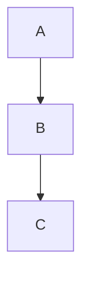

# md4x — User Help

Welcome to md4x. Convert Markdown to magazine-quality PDF with a live
editor↔preview workflow. This document is bundled with the app and
opened from the toolbar **?** icon or the **Help → md4x Help** menu
item.

---

## At a glance

- **Editor** on the left, **live preview** on the right.
- Block-aligned scroll sync: the same block stays visible on both
  sides as you scroll.
- Six built-in templates (magazine, swiss, stem, tufte, newyorker,
  brutalist).
- KaTeX math, mermaid diagrams, syntect code highlighting, admonish
  call-outs, numbered theorems — all rendered in the preview iframe
  and in the exported PDF using the same kernel.

---

## Shortcuts

| Action | macOS shortcut |
|--------|----------------|
| New draft | **⌘N** |
| Open file | **⌘O** |
| Save | **⌘S** |
| Save As | **⌘⇧S** |
| Export PDF | **⌘E** |
| Settings | **⌘,** |
| Quit | **⌘Q** |

The **Esc** key closes any open modal (Export, Settings, Help,
Undefined macros).

---

## Templates

Each template is a `templates/<name>/style.css` plus per-template body
padding that matches its `@page` margins. Switch via the **Template**
button in the toolbar — preview updates in place.

The export pipeline uses the same template files as the live
preview, so what you see is what you ship.

---

## Live preview

- The preview is an iframe rendered by the same kernel the CLI uses.
- Editor scroll, cursor moves, and template swaps trigger
  block-aligned re-syncs. The block-alignment ticks on the
  splitter-facing edges of each pane (since v0.2.3) confirm
  alignment visually:
  - Faint horizontal ticks mark every block.
  - A red arrowhead tracks the **cursor's block** on each side. When
    the two ticks meet at the splitter, the panes are aligned.
  - When the cursor's block scrolls off-viewport, the red tick falls
    back to the strip's middle (dimmed) so you can still see the
    direction.
- The splitter is a 2-pixel rail. Drag to resize.

---

## Math (KaTeX)

Inline math: `$E = mc^2$`. Display math: `$$\int_0^1 x \, dx$$`.

User-defined macros live in `<file>.macros.json` next to the
markdown source. Example:

```json
{
  "\\R":   "\\mathbb{R}",
  "\\eps": "\\varepsilon"
}
```

If the preview shows raw `\name` text where math should be, KaTeX
couldn't expand a macro. The status-bar **⚠ undefined macros** pill
opens a modal listing them.

### Self-contained markdown

Once a `.macros.json` is filled in, click **Inline into document**
in the undefined-macros modal. The JSON is embedded as an HTML
comment block at the end of the `.md` file:

```text
<!-- md4x:macros
{
  "\\R": "\\mathbb{R}"
}
-->
```

The block is invisible in every other markdown tool and is
stripped before render. **Distribute the `.md` on its own** — it
ships self-contained.

If a sidecar `.macros.json` and an inline block both exist,
**inline wins** on per-key conflict. Run `md4x macros lint <file>`
to surface any divergence.

#### CLI

```
md4x macros inline <file.md>   # embed sidecar JSON into markdown
md4x macros split  <file.md>   # extract block back into sidecar
md4x macros show   <file.md>   # print effective merged macros
md4x macros lint   <file.md>   # report conflicts (exits non-zero)
```

`md4x macros inline --delete-sidecar` removes the JSON file after
inlining.

---

## Diagrams (mermaid)

Fenced code with `mermaid` language renders as a diagram:

````markdown

````

Diagrams are rendered client-side in the preview and as embedded
SVG in the exported PDF.

---

## Admonish call-outs

Triple-colon fenced blocks render as styled call-outs:

```markdown
:::note
Note body.
:::

:::warning
Watch out.
:::
```

Kinds: `note`, `info`, `tip`, `warning`, `danger`, `example`,
`success`, `quote`, `bug`, `failure`, `hint`, `important`,
`question`, `summary`.

---

## Numbered theorems

Use the `numthm` plugin syntax for automatic numbering:

```markdown
::: theorem
**Pythagoras.** In a right triangle, $a^2 + b^2 = c^2$.
:::
```

Numbering resets per top-level heading. See template-specific CSS
for visual style.

---

## Settings

The **⚙ Settings** drawer (⌘,) controls:

- **Default template** — applied on app launch.
- **Preview debounce** — 0–800 ms in 1 ms steps. Lower = snappier
  preview at higher CPU; higher = calmer at the cost of latency.
- **Preview zoom** — 50–200 %.
- **Editor theme** — dark (default) or light.
- **Reveal in Finder on export** — open the output folder after
  successful PDF export.

---

## Export

**Export PDF** (⌘E) opens a dialog with file name, location, and
template. The exported PDF is byte-equivalent to `md4x render` from
the CLI on the same input.

---

## Files

- `<file>.md` — your source.
- `<file>.macros.json` — sidecar for KaTeX user macros (optional;
  may be inlined per above).
- `<file>.pdf` — default export name.

md4x writes only to user-specified outputs and a temporary scratch
directory adjacent to the output (deleted on success). No global
config files.

---

## License

md4x is AGPL-3.0-only. See the `LICENSE` file at the repository
root.
