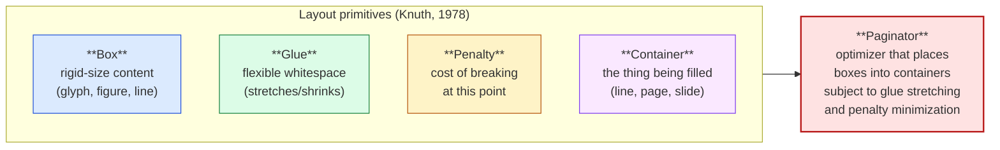
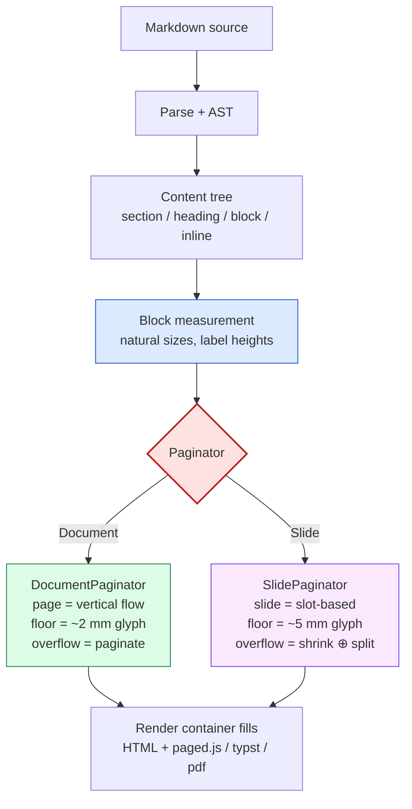
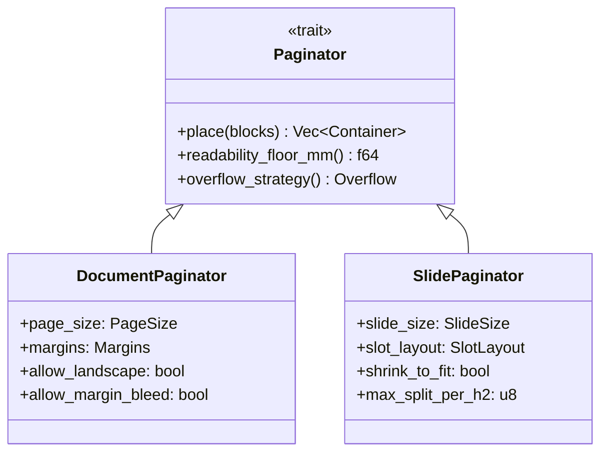
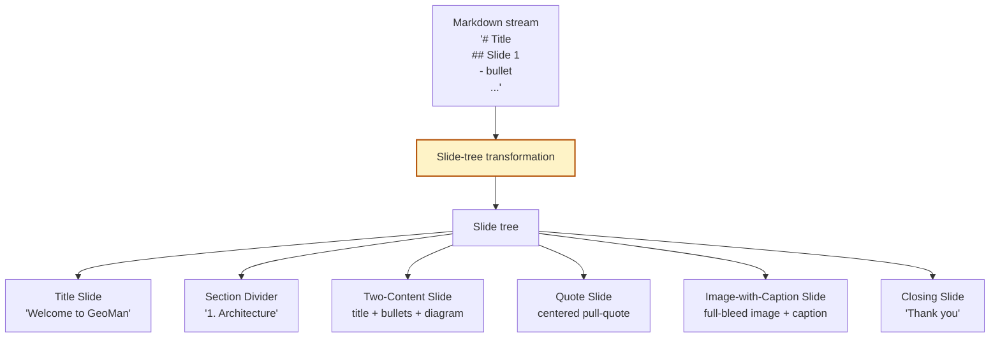
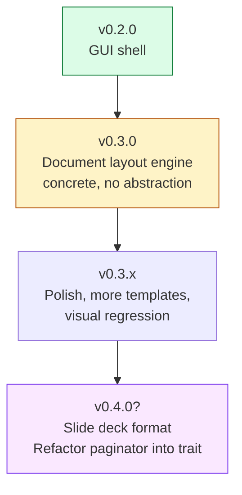
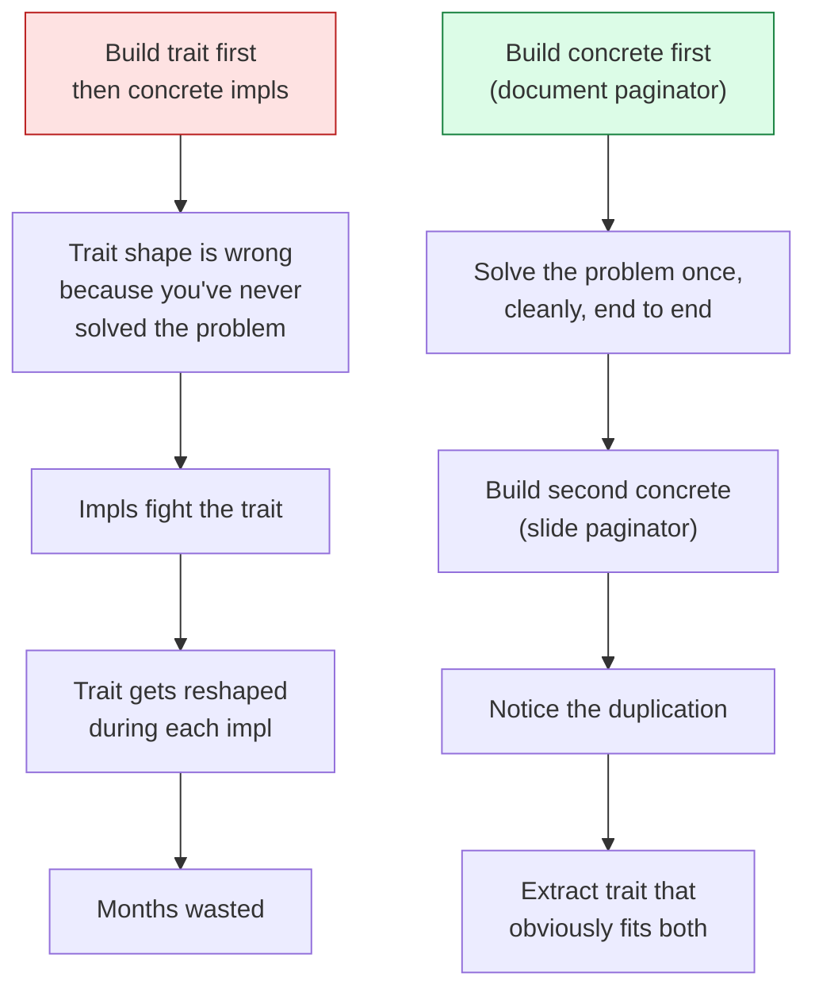

# Paginator architecture (notes for v0.3.0 and beyond)

*A common abstraction sketch for document pagination (v0.3.0) and slide
deck layout (later v0.x). Not a binding design — these are notes for
when we get there. The concrete code comes from building the document
paginator first; the abstraction emerges after.*

---

## 1. The shared primitives

Both pages and slides are containers we fill with content. Knuth's
**box-and-glue** model from TeX is the right level of abstraction:



Document layout and slide layout are **paginators over the same
primitives**, with different containers and different penalty
functions. They aren't different problems; they're the same problem
parameterized differently.

## 2. Comparison: document vs. slide

| | Document | Slide deck |
|---|---|---|
| **Container** | A4/Letter page (~210×297mm), vertical flow | 16:9 slide (~254×143mm), slot-based |
| **Content tree from markdown** | H1/H2/H3 → sections; paragraph → flowing text; figure → atomic block | H1 → section divider; H2 → slide title; list → bullets; code/figure → focal element |
| **Reading model** | Sequential, eyes scan continuously | Self-contained per slide, presenter-paced |
| **Whitespace** | Functional (paragraph rhythm, gutter) | Generous (impact, readable from back of room) |
| **Atomicity** | Figure + caption; table + title; section heading + first paragraph | Title + content + footer slots; one focal element |
| **Overflow strategy** | Paginate to next page (text reflows continuously) | Shrink-to-fit ⊕ split slide ⊕ truncate (no reflow) |
| **Micro-typography priority** | High (line breaking, hyphenation, kerning) | Low (impact and presence matter more) |
| **Number of containers per source unit** | Many pages per chapter | Often 1 slide per H2 |
| **Content density** | High (~500 words/page) | Low (~30 words/slide) |
| **Background** | Same on every page (template background) | Often per-slide (image, gradient, accent) |

The columns share more than they differ at the abstraction level.
Where they differ — how overflow is handled, how generously space is
allocated, what counts as "atomic" — those are *parameters* of a
paginator, not different paginators.

## 3. The structural pipeline



The shared steps — **parse, build content tree, measure blocks** — are
the same for both output formats. The fork is at the paginator. The
renderer downstream is also format-specific (HTML for docs, HTML or
SVG for slides).

## 4. The paginator as a trait (eventual shape)

When v0.3.0 ships document layout and the slide-deck format arrives
later, the abstraction probably looks something like this:

```rust
pub trait Paginator {
    /// The format-specific container — e.g. a Page with header/body/
    /// footer regions, or a Slide with title/content/footer slots.
    type Container;

    /// Measured input block (rendered SVG bounds, line heights, etc.).
    type Block;

    /// Place all blocks into a sequence of containers respecting
    /// reading order, atomicity rules, and the readability floor.
    fn place(&self, blocks: &[Self::Block]) -> Vec<Self::Container>;

    /// Minimum legible glyph height in mm. Below this, content
    /// is unreadable; the paginator must escalate (float, split,
    /// landscape, etc.) rather than shrink past it.
    fn readability_floor_mm(&self) -> f64;

    /// What the paginator does when content exceeds container
    /// capacity even at the floor.
    fn overflow_strategy(&self) -> Overflow;
}

pub enum Overflow {
    /// Continue text into a new container (documents).
    Paginate,
    /// Shrink to fit; split into multiple slides if shrunk past
    /// floor; truncate as last resort (slides).
    ShrinkSplitTruncate,
}
```



This isn't ready to be designed. Build the document paginator
concretely first, observe what's awkward, *then* refactor into a trait.
Premature abstraction is the worse failure mode.

## 5. What's slide-specific (and hard)

The hard part of slide layout isn't placement — it's **transforming a
flat markdown stream into a slide tree**. Markdown gives you headings +
content; slides want stylized layouts:



The transformation rules are heuristic and template-specific. A
"two-content" slide is appropriate when an H2 has both bullets and a
diagram; a "quote slide" when an H2 has only a single blockquote;
section dividers between H1s; etc. Templates would declare these
mappings.

This intelligence is *separate* from the paginator. The paginator gets
a tree of typed slides and places content into them. The transformation
is a different layer.


The paginator's job: given `TwoContentSlide{title, bullets, figure}`,
decide whether all three fit, which to shrink, whether to split.
Same shape as document figure placement — measure, fit, escalate.

## 6. What document and slide layouts share concretely

Even before the trait exists, these components will be reused
across both output formats:

| Component | Used by docs? | Used by slides? |
|---|---|---|
| Markdown → AST (comrak) | yes | yes |
| Plugin pipeline (mermaid/KaTeX/syntect) | yes | yes |
| SVG / text measurement (block measurement pass) | yes | yes |
| Readability floor model (per-template parameter) | yes | yes |
| Content tree representation | yes (sections / blocks) | yes (slides / slots) |
| Caption + figure atomicity | yes | yes (different shape) |
| Cross-reference numbering | yes | partial (within-deck) |
| paged.js or equivalent paged-media polyfill | yes | maybe (slides may bypass) |
| Chrome --print-to-pdf | yes | yes (PDF deck output) |

The shared substrate is large. **Don't build slide support as a
separate codebase.** Build it on the same kernel + plugins +
measurement layer that v0.3.0 produces.

## 7. Order of operations



Sequencing rationale:

- **v0.2.0** ships the GUI with current naive layout. The closed
  edit-preview loop helps debug v0.3.0 layout work later.
- **v0.3.0** builds the document paginator *concretely*. No abstraction
  yet. The visible win: fix the geoman blank-page class of bugs;
  ship LaTeX-grade figure placement.
- **v0.3.x** polishes — per-template tuning, visual regression suite,
  more figure types (tables, blockquotes, code blocks all benefit
  from the same atomicity + float logic).
- **v0.4.0 (or later)** adds slide deck format. *Now* refactor the
  paginator into a trait, with `DocumentPaginator` and `SlidePaginator`
  as concrete impls. The trait shape will be obvious by then because
  we'll have lived with the document case for months.

## 8. Resist abstracting too early

Worth saying twice. The biggest failure mode for "common architecture"
work is abstracting before having two concrete instances:



We don't know what the right paginator trait looks like yet. Anyone
who claims to know is guessing. Build, observe, refactor.

## 9. Reading list (for the long evening)

If you ever want to go deep on the algorithms behind this:

- Knuth, *The TeXbook*, Appendix G (the page-builder algorithm).
- Knuth, *Digital Typography*, chapters 3 and 15.
- Knuth & Plass, "Breaking paragraphs into lines" (1981) — the
  line-breaking optimizer, generalizable to other 1-D packing problems.
- The paged.js source — a CSS Paged Media polyfill, ~5K LOC, readable.
- Tectonic (Rust port of XeTeX) — if curious about a modern TeX engine.
- Typst — modern (Rust) typesetting language with its own paginator;
  shows what a clean post-TeX design looks like.

## 10. Bottom line

There is a real common model. The box-and-glue abstraction Knuth
designed for TeX in 1978 is the right level of abstraction for both
documents and slide decks. Building v0.3.0's document paginator with
*awareness* that a slide paginator will join it later is wise; building
the *abstraction* before either exists is foolish.

Order: build it, then abstract it. We'll know the trait shape when we
see it.
