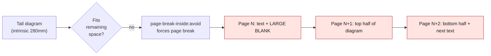
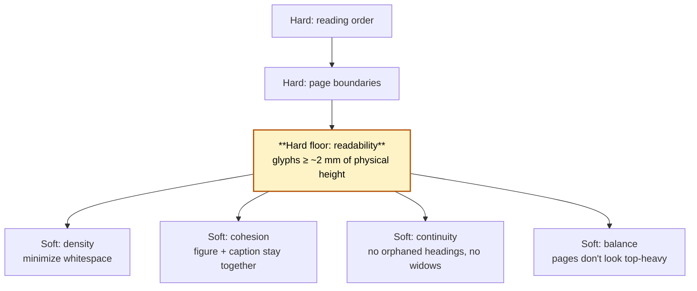
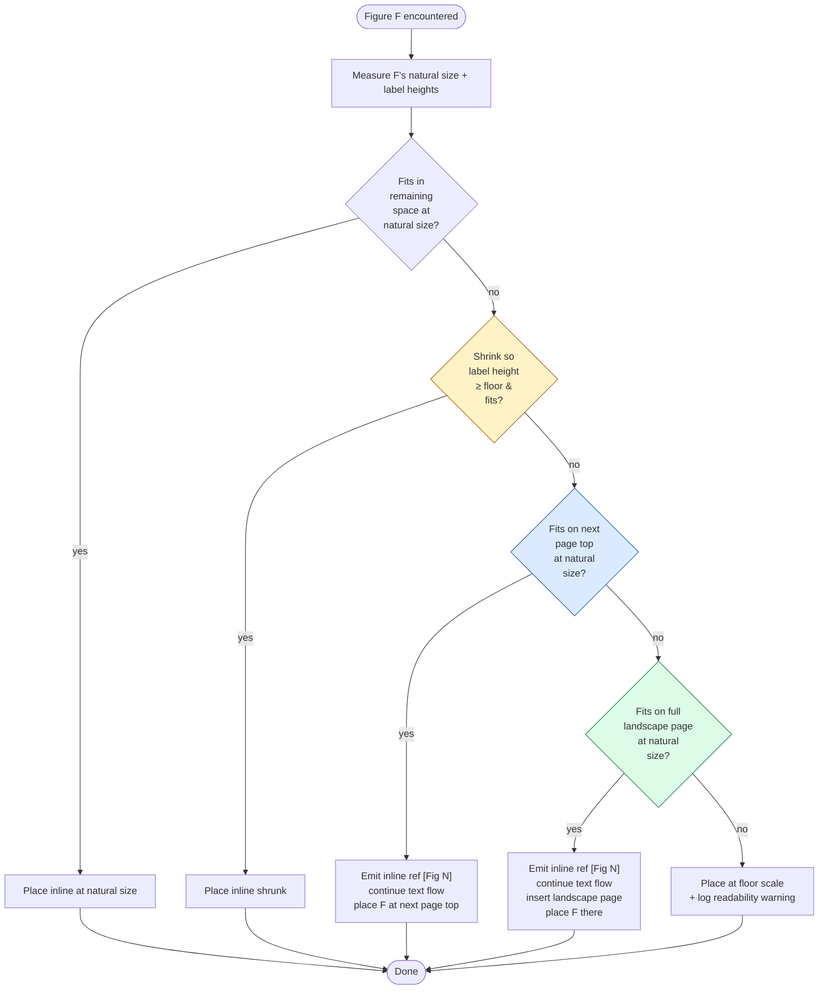
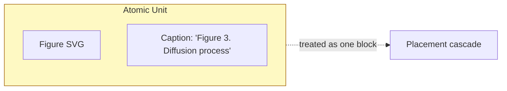
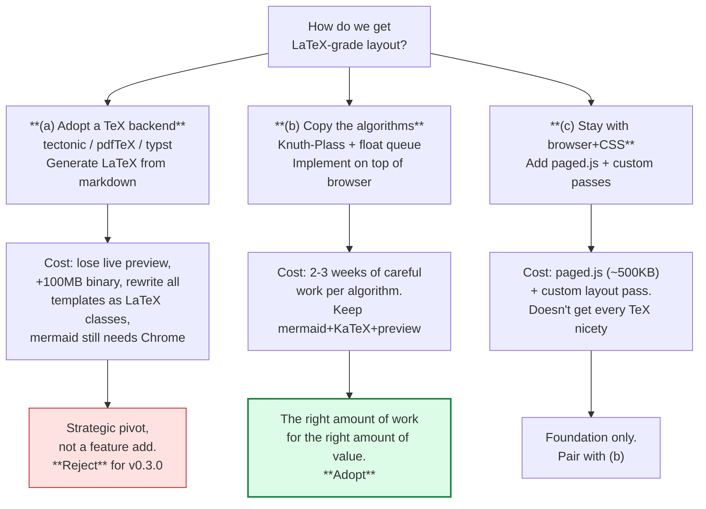
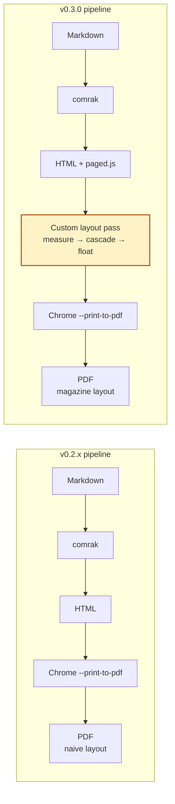
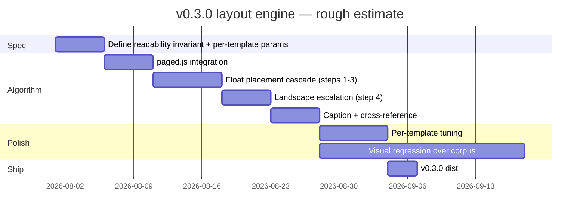

# md4x v0.3.0 — Layout Engine

*Discussion notes captured at the end of the v0.1.x → v0.2.0 transition.
This is the *next* big quality wedge after the GUI ships.*

---

## 1. The problem

Current md4x layout is naive. The kernel renders markdown to HTML; the
templates apply CSS; Chrome handles pagination via CSS Paged Media. For
prose this works. For figures, it produces visible failures:



Two failure modes overlap: (1) tall figures get split across pages, and
(2) the page before the figure ends up mostly blank because
`page-break-inside: avoid` evacuates the figure to the next page only
*after* the kernel has already committed text to the current page.

The current `max-height: 220mm` cap is a placeholder. It prevents the
split, but trades it for "diagram on its own page, body text orphaned
two pages earlier." Not a layout solution. A bandage.

## 2. The essence

Pagination is a constraint-satisfaction problem with a clear
hierarchy:



The most important insight: **readability is a hard floor, not a
preference.** A glyph below ~2 mm at typical reading distance is
unreadable. Browsers happily scale figures past this floor because they
have no model of "is this still legible." LaTeX has the floor
implicitly — figures are placed at natural size and floated when they
don't fit; LaTeX never silently shrinks below readability.

We need to model the floor explicitly.

## 3. Heuristic cascade for figure placement



The cascade in plain words:

1. **Try inline at natural size.** If it fits, place it there.
2. **Try inline shrunk.** Scale down, but never past the readability
   floor. If we can fit in remaining space without crossing the floor,
   place inline.
3. **Float to next page top.** Emit a discreet inline reference (`see
   Figure 3`) where the figure would have been; let text flow continue;
   place the figure at the top of the next page.
4. **Landscape escape hatch.** For very wide diagrams (technical
   architecture, wide flowcharts) where even a full portrait page
   doesn't give enough character height: insert a single landscape page
   for the figure alone. Text flow continues on the next portrait page.
5. **Force-shrink with warning.** If even landscape can't host the
   figure at floor scale, we've hit a content problem (diagram too
   complex for the document format). Render at floor anyway, log
   warning so the writer can simplify the diagram or split it.

## 4. The unit is figure + caption

Captions are atomic with their figures. Decisions in the cascade apply
to the unit, never to the diagram alone. A caption stranded on a
different page from its figure is a typography failure even if
technically legal.



This rules out: caption first, figure later; figure on page N, caption
on page N+1; figure rotated landscape with caption on the next portrait
page (caption rotates too).

## 5. Cross-references that feel magazine-y

Engineering shorthand `[Fig 3]` is fine in a code review. In a published
document it should read like a magazine:

| Distance | Form |
|---|---|
| Same page | "(Figure 3)" inline parenthetical, no special glyph |
| Next page | "Figure 3 ↗" with a small navigational glyph |
| Far away | "Figure 3 (p. 14)" with explicit page reference |

The numbering is auto-resolved at typeset time. md4x already has
infrastructure for this kind of thing (the cover-text rewriter, the
plugin contract); a `cross-reference` plugin slots in cleanly.

## 6. Should we copy LaTeX?

The deepest question. Three options, each priced honestly:



**Decision:** copy the algorithms (b) on top of paged.js (c). The
browser path is load-bearing for v0.2.0's live preview; we don't
abandon it. The TeX algorithms — Knuth-Plass for line breaking, the
float placement queue, caption-figure atomicity, cross-reference
numbering — are documented and transplantable. Hundreds of lines of
careful code, not millions.

If at some future point live preview turns out not to matter
(e.g. users only care about final PDF), reopening the typst-as-backend
conversation is reasonable. Not before.

## 7. Implementation sketch



The custom layout pass runs as JavaScript inside the rendered HTML
*before* Chrome triggers print. It has full access to:

- Each rendered SVG's bounding box (via `getBBox()` and `getCTM()`).
- Each `<text>` element's computed font-size in CSS pixels, convertible
  to mm via the page's known `dpi`.
- The current scroll/page geometry (paged.js exposes this).

Pseudocode for the pass (~200-400 lines of JS in practice):

```
for each <figure> in reading order:
    natural_height = measure(figure)
    label_height_at_natural = min(text_run.height for text_run in figure)
    
    # Try (1): inline natural
    if natural_height <= remaining_space_on_current_page:
        place_inline(figure)
        continue
    
    # Try (2): inline shrunk
    max_shrink = remaining_space_on_current_page / natural_height
    label_height_shrunk = label_height_at_natural * max_shrink
    if label_height_shrunk >= READABILITY_FLOOR_MM:
        place_inline_shrunk(figure, max_shrink)
        continue
    
    # Try (3): float to next page
    if natural_height <= page_height:
        emit_inline_ref(figure)
        queue_float_to_next_page(figure)
        continue
    
    # Try (4): landscape
    landscape_height = page_width   # rotated
    if natural_height <= landscape_height:
        emit_inline_ref(figure)
        queue_landscape_page(figure)
        continue
    
    # Force-shrink + warn
    force_shrink_to_floor(figure)
    log_warning("Figure too complex for page format")
```

## 8. Per-template parameters

The readability floor isn't universal — different templates suit
different content. Tufte's wide right margin lets figures bleed into
margin space; Brutalist's heavier weight tolerates smaller labels;
academic templates (stem) want stricter floors.

Each template gains layout parameters:

```
{
  "readability_floor_mm": 2.0,
  "preferred_glyph_mm": 2.5,
  "ceiling_height_pct_of_page": 80,
  "allow_landscape": true,
  "allow_margin_bleed": false,
  "caption_style": "italic-9pt"
}
```

Plugin contract gains a method to expose these (or templates declare
them via JSON next to `style.css`).

## 9. What v0.3.0 explicitly is and isn't

In scope:
- Figure placement cascade (the main event)
- Caption-figure atomicity
- Cross-reference numbering with same-page / next-page / page-N forms
- paged.js integration for proper @page boxes, running heads,
  page numbers in the right places
- Per-template layout parameters
- Visual regression suite over the corpus + GeoMan + 001.md

Out of scope (deferred to v0.3.x or later):
- Knuth-Plass line breaking (Chrome's text shaper is already very good)
- Multi-figure side-by-side layout (two narrow figures together)
- Text flowing around figures (LaTeX `\wrapfigure`-style)
- Footnote-as-sidenote conversion (Tufte template scaffold exists; needs
  the layout pass to populate it)
- Index / table of contents auto-generation
- Multi-column body text (newspaper-style broadsheet template)

## 10. Estimated effort



~6 weeks of focused work for a v1 that visibly closes the geoman-blank-page
bug class. Polish continues for months — every PDF you generate where
the layout is visibly wrong is data for tuning.

## 11. The deepest framing

Don't think of this as "fix the diagram bug." Think of it as
**md4x's first layout engine pass.** Diagrams are the visible failure
mode; the underlying issue is that we don't model layout, and that
limits how good the output can ever be. The work pays for itself
across diagrams, tables, blockquotes, code blocks, and section breaks.

md4x's wedge is "magazine-grade typography." Magazines and books have
sophisticated layout — pull-quotes, side-figures, captions, page
floats. If we ship with naive blocking layout we're not actually
delivering magazine-grade. We're delivering "Markdown with nice CSS."
The pagination work is what gets us closer to "feels like a publishing
house."

Worth doing properly. Worth doing after v0.2.0.
