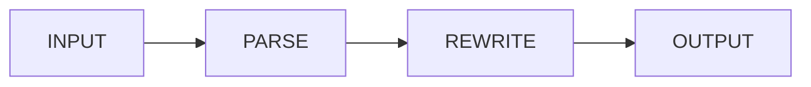

# Build For The Reader Or Don't Build

A demonstration of the Brutalist Zine template. Helvetica everywhere. Black and red and one note of yellow. Numbers as features. Page furniture as content. **Visible structure is honest structure.**

## On Honesty

A document that hides its scaffolding is a document that is asking the reader to trust the writer's invisible decisions. A document that *shows* its scaffolding — the section number, the page number, the rule across the top, the deliberate asymmetry of the gutter — is asking the reader to *see* what the writer has chosen, and to push back where the choices fail.

This is a small ethical claim disguised as a typographic one.

## Tables As Tables

A table is a data structure rendered in two dimensions. Set it heavy, label its columns in capitals, and let the reader's eye travel without distraction.

| Layer | What it does | Failure mode |
|-------|--------------|---------------|
| Type  | Carry the voice | Quiet, polite, dead |
| Color | Mark the structure | Decoration, no meaning |
| Grid  | Carry the rhythm | Symmetric, no tension |
| Rules | Mark the hierarchy | Hairline, decorative |

## A Pull Quote

Pull quotes are typeset in monospace and bordered with a slab of black. They are not "decorative quotations." They are *the loudest sentence on the page*, set in a face that announces it has been quoted.

> "The fastest way to make a document worse is to add a typeface."

## Code Is Code

```rust
pub fn run(args: &Args) -> Result<()> {
    for path in &args.inputs {
        render(path).with_context(|| path.display().to_string())?;
    }
    Ok(())
}
```

```ts
const reduce = <A, B>(xs: A[], z: B, f: (b: B, a: A) => B): B =>
  xs.reduce(f, z);
```

## A Diagram, Drawn



## Math Without Apology

The Cauchy–Schwarz inequality:

$$|\langle u, v \rangle| \leq \|u\| \cdot \|v\|.$$

It is true. It is *useful*. It is **not pretty**.

## On Structure

- The page numbers are in the corner because the corner is where they go.
- The footnotes have a thick black bar above them because they are a *different kind of text*.
- The pull-quotes are in monospace because monospace looks like a typewriter and a typewriter is what people used when they meant it.
- The section heads are uppercase because uppercase reads as **a head**.

## Closing

A zine is the form of document that has no copy editor and no art director and is therefore allowed to be exactly what its writer wants it to be. This is a privilege, and it is the only kind of typography worth defending.
