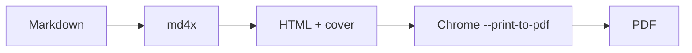

# The Magazine Style

A long-form article reference document for the md4x magazine template — restrained palette, real serif body, generous rhythm. Body text should remain comfortably readable across many pages.

## On Reading

Long reading happens at a different tempo than scanning. The page wants generous margins, comfortable line-height, and a serif that feels familiar without calling attention to itself. Iowan Old Style and Charter both work. Georgia survives as a fallback because it was designed for screens and prints respectably.

Justified text needs hyphenation to avoid rivers of whitespace. Drop caps signal the start of an article and quietly invite the reader in. A red rule between the kicker and the body adds editorial weight without ornament.

## Typographic Hierarchy

The hierarchy moves through sans-serif display headings, a small-caps eyebrow, the article title in a transitional serif, and a body in a workhorse serif sized to give about 65 characters per line. Subheads break long passages without shouting.

### Lists

- Editorial restraint
- Long-form rhythm
- Real serif body

### Tables

| Element       | Treatment              | Notes                |
|---------------|------------------------|----------------------|
| Body          | Iowan Old Style 11pt   | Serif, justified     |
| Heads         | SF Pro Display, bold   | Sans-serif, tight    |
| Accent        | Crimson #b91c1c        | Sparingly            |

> A great magazine page is not loud. It is composed.

### A diagram

## Closing

The aim is a page that feels considered. Code stays in its lane, blockquotes earn their margins, and the reader's eye finds rest at every turn.
