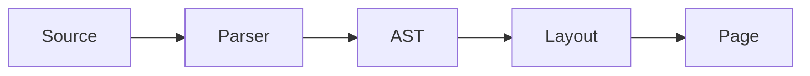

# On the Discipline of Margins

A demonstration of the Tufte template: serif body, hairline rules, and a wide right margin reserved for figures and sidenotes. Optimized for slow reading and reference-style technical writing.

## Why a Wide Margin

A wide outer margin is not wasted space; it is *active* space. It makes room for figures that would otherwise crowd the body, for footnotes set as sidenotes, and for the kind of breathing the eye needs when text is dense.

The body column is narrower than what most modern web layouts allow, but for printed prose this is the right answer: a measure of about 60–66 characters reads with the least eye fatigue across any line length you have tried.

### Typography

Charter and ET Bembo set in 11.5pt over a generous leading produce a page that reads as quietly as a well-edited book. Hyphenation and justification stay enabled; small caps and old-style figures travel through the document without fanfare.

### Tables That Behave

Tables are the place most documents lose their composure. Keep them quiet: a hairline rule above the headers, a hairline below the body, no zebra stripes, and numeric columns aligned on the decimal.

| Year | Volumes | Pages | Avg. words per page |
|------|---------|-------|---------------------|
| 1968 | 4       | 312   | 348                 |
| 1972 | 6       | 488   | 351                 |
| 1981 | 11      | 992   | 366                 |
| 1990 | 18      | 1,840 | 372                 |

## A Numerical Aside

A vector $\vec{v} \in \mathbb{R}^n$ is an ordered $n$-tuple of real numbers. The inner product is $\langle \vec{u}, \vec{v} \rangle = \sum_{i=1}^n u_i v_i$, and the norm follows: $\|\vec{v}\| = \sqrt{\langle \vec{v}, \vec{v} \rangle}$.

> A page should be designed so that the type, the figures, and the white space all participate in the argument.

## A Diagram



## Code Stays Quiet

```rust
fn read_aloud(text: &str) -> Result<()> {
    for line in text.lines() {
        println!("{line}");
    }
    Ok(())
}
```

## Footnotes

The bottom of the section is the right place for a footnote when the document is dense.[^1] In a future version, footnote text will be promoted into the right margin as proper sidenotes; for now, the conventional placement is preserved.[^2]

[^1]: The CSS scaffolding for sidenotes is present in this template; activating it requires either a small server-side AST rewrite or a print-time JS pass that clones footnote content into floated `<aside class="sidenote">` elements.
[^2]: Footnotes render in italic small type at the end of the section, with a hairline rule separating them from the body.

## Closing

The template's job is not to be invisible — it is to be *quiet*. Quiet typography lets the writing carry the weight, and the reader notices the writing rather than the layout.
